<div align="center">
<h1><a id="intro">Лабораторная работа №1</a><br></h1>
<a href="https://docs.github.com/en"></a>
<a href="https://daringfireball.net/projects/markdown"></a> 
<a href="https://symbl.cc/en/unicode-table"></a> 
<a href="https://shields.io"></a>
<a href="https://img.shields.io/badge/Risk_Analyze-2448a2"></a> </a> </a></div>


1. Создайте локальный репозиторий на машине
2. Проинициализируйте репозиторий
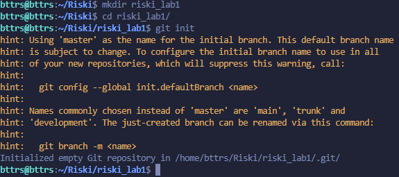

3. Авторизуйтесь и спользуйте `GitHub CLI` для создания удаленного репозитория
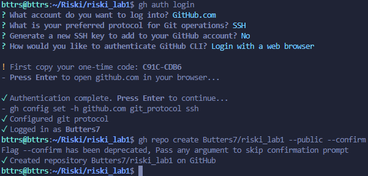

Репозиторий: https://github.com/Butters7/riski_lab1

4. Создайте пустой README.md 
```bash
touch README.md
```

5. Используйте указание URL своего созданного репозитория для присвоения ветки`master` статуса `origin`
```bash
git remote add origin git@github.com:Butters7/riski_lab1.git
```

6. В локальном репозитории и сделайте `commit`
```bash
git add README.md
git commit -S -m "first commit"
```
ID коммита: e78f054  
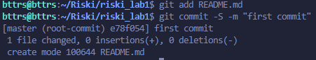

7. Сделайте публикацию своего `commit` с флагом `-S` в удаленный репозиторий
```bash
git push -u origin master
```
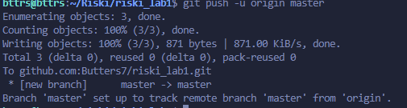

8. Создайте файл `hello.py` в локальном репозитории. Реализуйте **Hello appsecworld** на языке python используя несколько интерпретаторов с "грязным" кодом
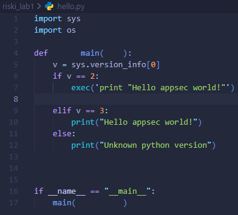

9. Сделайте `commit` с флагом `-S`  
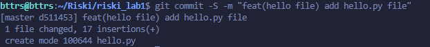
ID коммита: d511453

10. Измените исходный код, что бы скрипт запрашивал имя пользователя и выводил `Helloappsec world from @name`
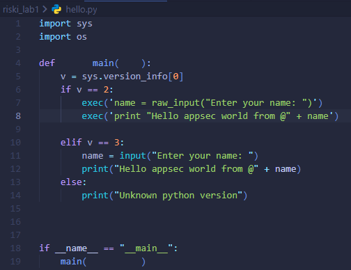

11. Сделайте `commit` с флагом `-S` и сделайте публикацию в удаленный репозиторий.Проверьте вывод истории изменений  
ID коммита: d8e1111  
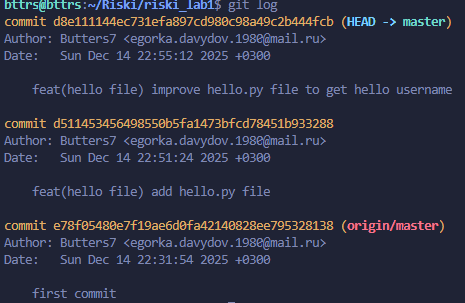

12. В локальном репозитории создайте ветку `patch1` и внесите изменения исправлению кода и модернизации до следующего вида, что бы код был рабочим. Сделайте публикацию своего `commit` с флагом `-S` в удаленный репозиторий:
```bash
git checkout -b patch1
```
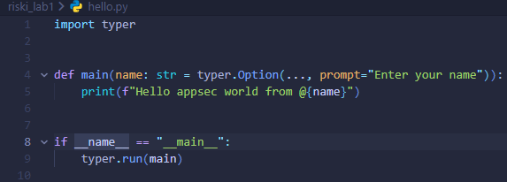
ID коммита: bab4b50

13. Проверьте, что ветка `patch1` в удалённом репозитории
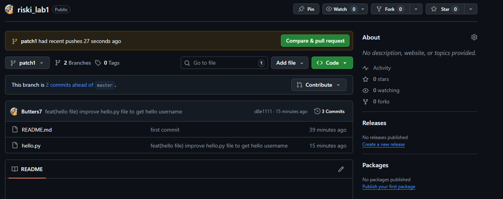

14. Создайте `pull-request` в виде `patch1 -> master`
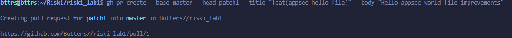

15. В ветке `patch1` добавьте в исходный код комментарии и убедитесь, что есть указанные изменения в `pull-request`  
ID коммита: 741776e
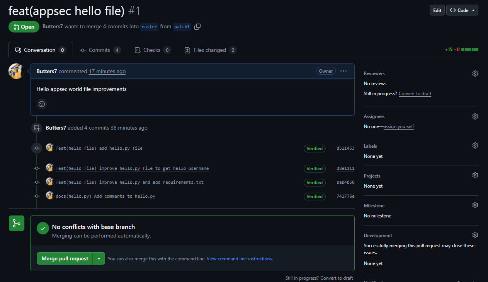
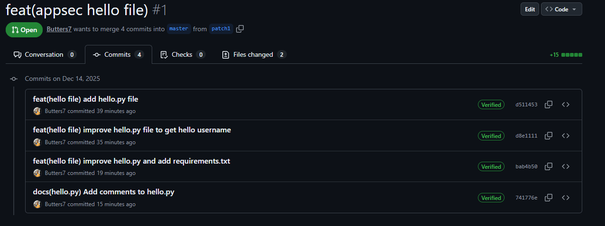

16. В удалённый репозитории выполните слияние `pull-request` для `patch1 -> master` и удалите ветку `patch1`
ID коммита: cbd576d
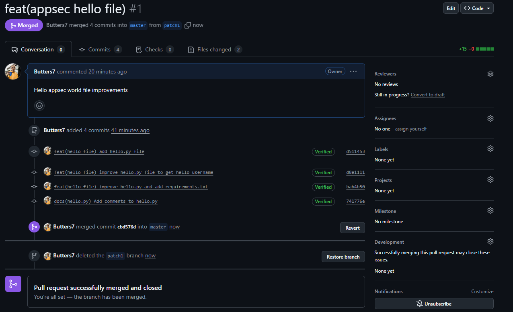

17. Стяните последние актуальные изменения и просмотрите историю изменений для `master`
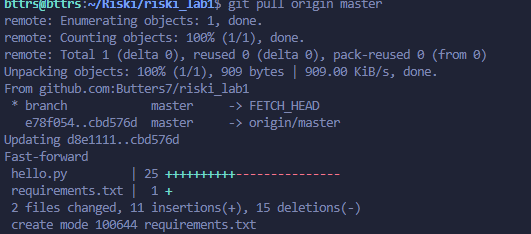
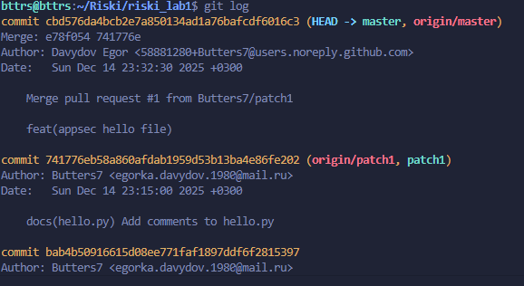

18. Удалите локальную ветку `patch1`
```bash
git branch -d patch1
```

19. Создайте новую локальную ветку `patch2`.
```bash
git checkout -b patch2
```

20. Измените *code style* по своему усмотрению
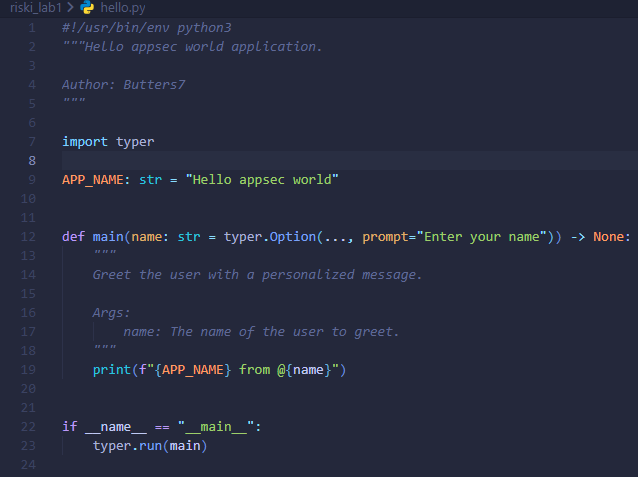

21. Сделайте публикацию своего `commit` с флагом `-S` в удаленный репозиторий исоздайте pull-request `patch2 -> master`  
ID коммита: 8952d54

22. В ветке **master** удаленного репозитория явно измените комментарий  
ID коммита: 47ffd57

23. Увидите, что в `pull-request` появились расхождения
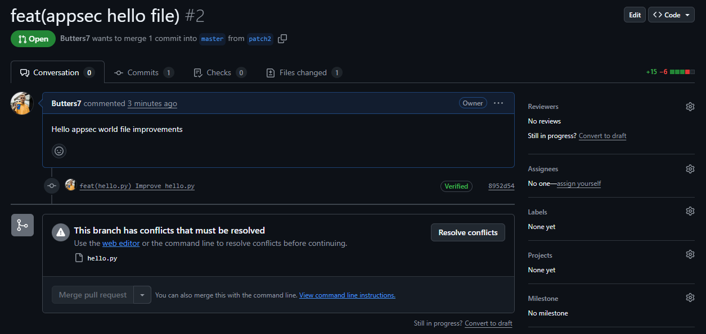

24. Локально сделайте **rebase** и исправьте расхождения (это называется **конфликт**)
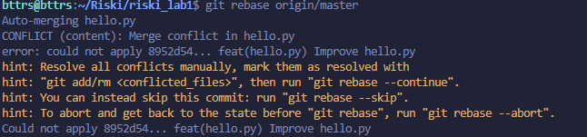
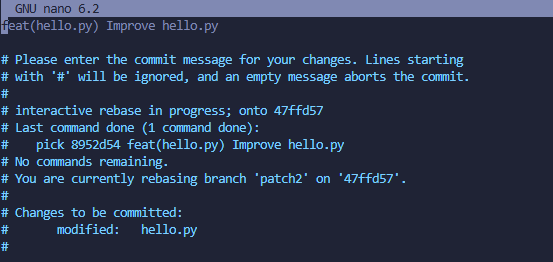

25. Сделайте `commit` и опубликуйте изменения в ветке `patch2`
ID коммита: 06d4011

26. Убедитесь, что пропали конфликтны. 
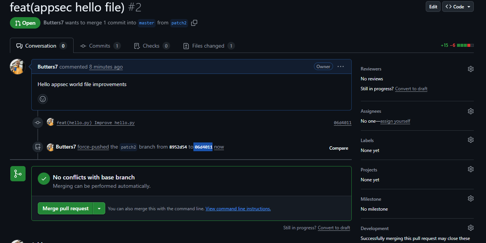

27. Сделайте `merge` для `pull-request` `patch2 -> master`.  
ID коммита: 5a9cd24
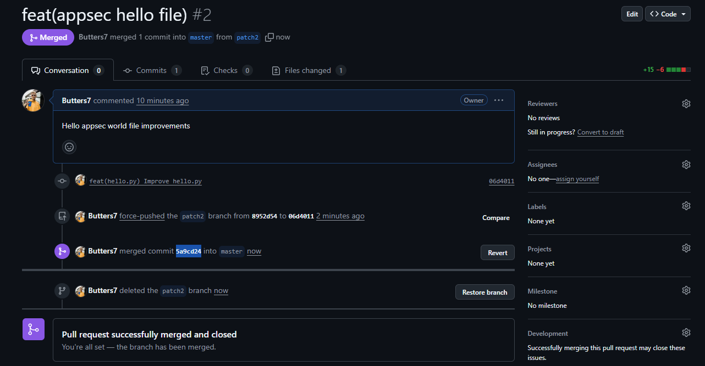

28. Подготовьте отчет `gist`.

29. Продемонстрируйте в материалах отчета историю коммитов на локальном и удаленном репозитории.
**Локально:**
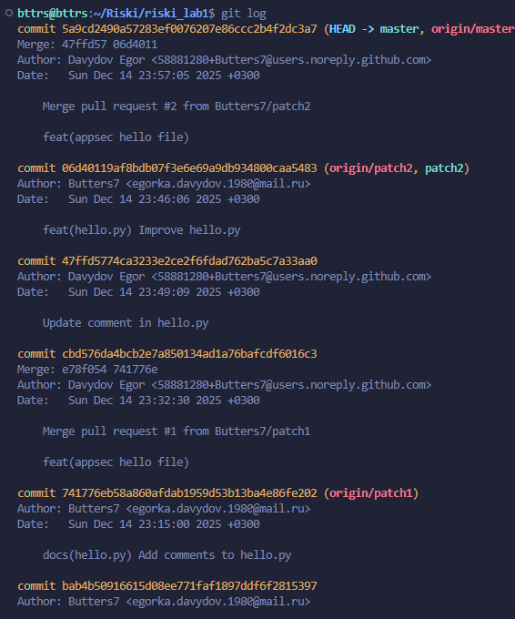

**Удаленно:**
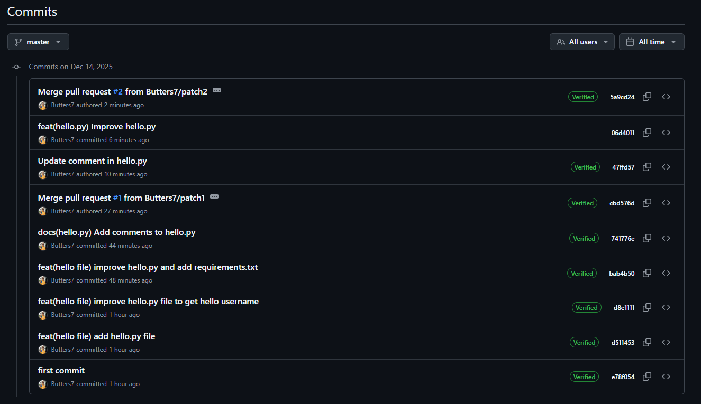

---
Copyright (c) 2025 Egor Davydov