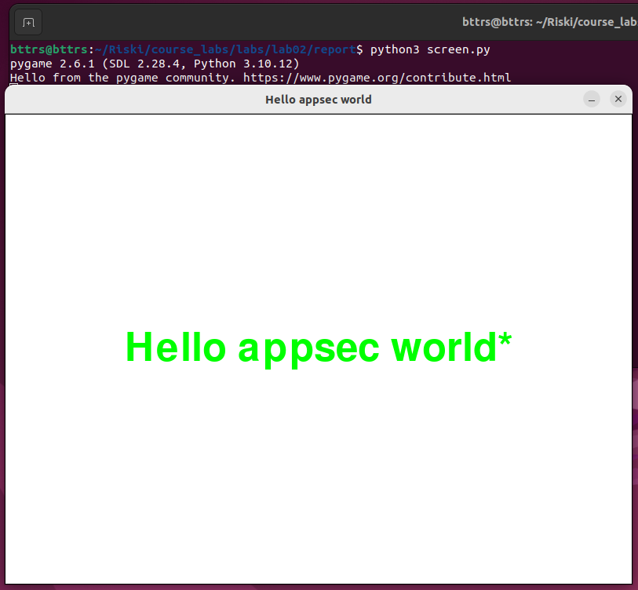

<div align="center">
<h1><a id="intro">Лабораторная работа №2</a><br></h1>
<a href="https://docs.github.com/en"></a>
<a href="https://daringfireball.net/projects/markdown"></a> 
<a href="https://symbl.cc/en/unicode-table"></a> 
<a href="https://shields.io"></a>
<a href="https://img.shields.io/badge/Risk_Analyze-2448a2"></a> </a> </a></div>

- [x] 1. Выведите на терминале и проанализируйте следующие команды консоли

```bash
bttrs@bttrs:~/Riski/course_labs$ who | wc -l
1

bttrs@bttrs:~/Riski/course_labs$ id
uid=1000(bttrs) gid=1000(bttrs) groups=1000(bttrs),4(adm),24(cdrom),27(sudo),30(dip),46(plugdev),122(lpadmin),135(lxd),136(sambashare)

bttrs@bttrs:~/Riski/course_labs$ whoami
bttrs

bttrs@bttrs:~/Riski/course_labs$ hostnamectl
 Static hostname: bttrs
       Icon name: computer-vm
         Chassis: vm
      Machine ID: 25afc9f0d32a4d838653242ee0cc95a3
         Boot ID: 72e9a842cd014d929a28d7bb10fed926
  Virtualization: oracle
Operating System: Ubuntu 22.04.5 LTS              
          Kernel: Linux 6.8.0-87-generic
    Architecture: x86-64
```

1. `who | wc -l` - Количество залогиненных пользователей
2. `id` - Показывает UID, GID и группы пользователя
3. `whoami` - Имя пользователя, под которым выполняется команда
4. `hostnamectl` - Имя хоста и информация о системе

- [x] 2. Выведите утилитой `tree` список вложенности дерева диреторий для каталога своего пользователя. Далее используйте `ls -a` и укажите отличие от `ls -l`.
```bash
bttrs@bttrs:~/Riski/course_labs$ tree ~
/home/bttrs
├── Desktop
├── Documents
├── Downloads
├── Music
├── Pictures
├── Public
├── Riski
...

bttrs@bttrs:~/Riski/course_labs$ ls -a
.   assets
...
```

`ls -a` показывает все файлы, включая скрытые файлы. `ls -l` показывает список файлов в вертикальном виде (скрытые файлы не показываются)

- [x] 3. Используйте утилиту `file` и `df` для определения какая файловая система на разделе `/dev/sda1`.
```bash
bttrs@bttrs:~/Riski/course_labs$ sudo file -s /dev/sda
/dev/sda: DOS/MBR boot sector, extended partition table (last)
bttrs@bttrs:~/Riski/course_labs$ sudo file -s /dev/sda1
/dev/sda1: data
```

```bash
bttrs@bttrs:~/Riski/course_labs$ df -T
Filesystem     Type    1K-blocks     Used Available Use% Mounted on
tmpfs          tmpfs      201576     1472    200104   1% /run
/dev/sda3      ext4     30267332 14743132  13961372  52% /
tmpfs          tmpfs     1007868        0   1007868   0% /dev/shm
tmpfs          tmpfs        5120        4      5116   1% /run/lock
/dev/sda2      vfat       524252     6232    518020   2% /boot/efi
tmpfs          tmpfs      201572      100    201472   1% /run/user/1000
/dev/sr0       iso9660     59942    59942         0 100% /media/bttrs/VBox_GAs_7.1.8
```

- [x] 4. Выведите на терминале и проанализируйте следующие команды консоли

```bash
bttrs@bttrs:~/Riski/course_labs$ which vi
/usr/bin/vi

bttrs@bttrs:~/Riski/course_labs$ locate hello.py
/home/bttrs/Riski/course_labs/labs/lab02/exmpl_hello.py
/home/bttrs/Riski/course_labs/labs/lab05/source/hello.py
/home/bttrs/Riski/riski_lab1/hello.py
/snap/gnome-42-2204/176/usr/lib/x86_64-linux-gnu/peas-demo/plugins/pythonhello/pythonhello.py

bttrs@bttrs:~/Riski/course_labs$ sudo updatedb

bttrs@bttrs:~/Riski/course_labs$ locate hello
/boot/grub/i386-pc/hello.mod
/boot/grub/x86_64-efi/hello.mod
/home/bttrs/Riski/course_labs/labs/lab02/exmpl_hello.py
/home/bttrs/Riski/course_labs/labs/lab05/source/hello.py
/home/bttrs/Riski/riski_lab1/hello.py
/snap/core22/1612/usr/lib/python3.10/__phello__.foo.py
/snap/core22/1612/usr/lib/python3.10/__pycache__/__phello__.foo.cpython-310.pyc
/snap/gnome-42-2204/176/usr/lib/python3.10/__phello__.foo.py
/snap/gnome-42-2204/176/usr/lib/x86_64-linux-gnu/peas-demo/plugins/helloworld
/snap/gnome-42-2204/176/usr/lib/x86_64-linux-gnu/peas-demo/plugins/pythonhello
/snap/gnome-42-2204/176/usr/lib/x86_64-linux-gnu/peas-demo/plugins/helloworld/helloworld.plugin
/snap/gnome-42-2204/176/usr/lib/x86_64-linux-gnu/peas-demo/plugins/helloworld/libhelloworld.so
/snap/gnome-42-2204/176/usr/lib/x86_64-linux-gnu/peas-demo/plugins/pythonhello/pythonhello.plugin
/snap/gnome-42-2204/176/usr/lib/x86_64-linux-gnu/peas-demo/plugins/pythonhello/pythonhello.py
/usr/lib/grub/i386-pc/hello.mod
/usr/lib/grub/x86_64-efi/hello.mod
/usr/lib/python3.10/__phello__.foo.py
/usr/lib/python3.10/__pycache__/__phello__.foo.cpython-310.pyc
/usr/share/locale-langpack/en@boldquot/LC_MESSAGES/hello.mo
/usr/share/locale-langpack/en@quot/LC_MESSAGES/hello.mo
/usr/share/locale-langpack/en_AU/LC_MESSAGES/hello.mo
/usr/share/locale-langpack/en_CA/LC_MESSAGES/hello.mo
/usr/share/locale-langpack/en_GB/LC_MESSAGES/hello.mo

bttrs@bttrs:~/Riski/course_labs$ touch screen

bttrs@bttrs:~/Riski/course_labs$ find ~ -name screen

bttrs@bttrs:~/Riski/course_labs$ locate screen
/var/lib/swcatalog/icons/ubuntu-jammy-universe/48x48/xfce4-screensaver_org.xfce.ScreenSaver.png
/var/lib/swcatalog/icons/ubuntu-jammy-universe/48x48/xfce4-screenshooter_org.xfce.screenshooter.png
/var/lib/swcatalog/icons/ubuntu-jammy-universe/64x64/deepin-screen-recorder_deepin-screen-recorder.png
/var/lib/swcatalog/icons/ubuntu-jammy-universe/64x64/gnome-screenshot_org.gnome.Screenshot.png
/var/lib/swcatalog/icons/ubuntu-jammy-universe/64x64/light-locker-settings_preferences-desktop-screensaver.png
/var/lib/swcatalog/icons/ubuntu-jammy-universe/64x64/screenkey_preferences-desktop-keyboard-shortcuts.png
/var/lib/swcatalog/icons/ubuntu-jammy-universe/64x64/screenruler_screenruler.png
/var/lib/swcatalog/icons/ubuntu-jammy-universe/64x64/simplescreenrecorder_simplescreenrecorder.png
/var/lib/swcatalog/icons/ubuntu-jammy-universe/64x64/vokoscreen-ng_vokoscreenNG.png
/var/lib/swcatalog/icons/ubuntu-jammy-universe/64x64/xfce4-screensaver_org.xfce.ScreenSaver.png
/var/lib/swcatalog/icons/ubuntu-jammy-universe/64x64/xfce4-screenshooter_org.xfce.screenshooter.png
/var/lib/swcatalog/icons/ubuntu-jammy-universe/64x64/xscreensaver_xscreensaver.png
```

1. `which vi` — показывает полный путь к исполняемому файлу vi
2. `locate hello.py` — ищет файл hello.py в системе по базе данных locate.
3. `sudo updatedb` — обновляет базу данных locate, индексируя файлы файловой системы.
4. `locate hello` — ищет все файлы и пути, содержащие hello, используя обновлённую базу.
5. `touch screen` — создаёт пустой файл screen
6. `find ~ -name screen` — ищет файл с именем screen в домашнем каталоге пользователя в реальном времени.
7. `locate screen` — мгновенно ищет все вхождения screen по всей системе через индекс locate.
8. `sudo updated` — попытка выполнить несуществующую команду, заканчивается ошибкой command not found.
9. `locate screen` — покажет результат только если база locate была обновлена корректной командой (updatedb).

- [x]  5. Используйте конструкцию и вставьте ее в созданный файл ранее. Подключите `pygame` - используем исключительно для стилизации окна.
Используемая конструкция:
```py
import pygame
pygame.init()

# Устанавливаем размеры окна
screen_width = 800
screen_height = 600
window_size = (screen_width, screen_height)
pygame.display.set_mode(window_size) # Создаем окно

# Задаем цвет фона
bg_color = (255, 255, 255)
pygame.draw.rect(screen, bg_color, [0, 0, screen_width, screen_height], 1)

# Выводим текст на экран
font = pygame.font.SysFont(None, 75)
text = font.render("Hello appsec world*", True, (0, 255, 0))
text_rect = text.get_rect()
text_rect.center = (400, 300)
screen.blit(text, text_rect)

while True:
    for event in pygame.event.get():
        if event.type == pygame.QUIT:
            pygame.quit()
            quit()
pygame.display.flip() # Обновляем экран
```

Получилось!!!


- [x] 6. Сделайте `commit` и `push` в свой репозиторий с изменениями в `master branch`. На следующих лабораторных работах мы вернемся к этому файлу.
```bash
bttrs@bttrs:~/Riski/course_labs$ git add labs/lab02/report/screen.py 
bttrs@bttrs:~/Riski/course_labs$ git commit -S -m "feat(game) Add screen.py"
[lab02 d0a5f35] feat(game) Add screen.py
 1 file changed, 40 insertions(+)
 create mode 100644 labs/lab02/report/screen.py
```
- [x] 7. Выведите на терминале и проанализируйте следующие команды консоли

```bash
bttrs@bttrs:~/Riski/course_labs$ groups
bttrs adm cdrom sudo dip plugdev lpadmin lxd sambashare
bttrs@bttrs:~/Riski/course_labs$ sudo useradd smallman
bttrs@bttrs:~/Riski/course_labs$ sudo userdel smallman -rf
userdel: smallman mail spool (/var/mail/smallman) not found
userdel: smallman home directory (/home/smallman) not found
bttrs@bttrs:~/Riski/course_labs$ sudo useradd smallman
bttrs@bttrs:~/Riski/course_labs$ sudo passwd smallman
New password: 
BAD PASSWORD: The password is shorter than 8 characters
Retype new password: 
passwd: password updated successfully
bttrs@bttrs:~/Riski/course_labs$ sudo usermod smallman -c 'Hach Hachov Hacherovich,239,45-67,499-239-45-33'
bttrs@bttrs:~/Riski/course_labs$ sudo passwd smallman
New password: 
BAD PASSWORD: The password is shorter than 8 characters
Retype new password: 
passwd: password updated successfully
bttrs@bttrs:~/Riski/course_labs$ id smallman
uid=1001(smallman) gid=1001(smallman) groups=1001(smallman)
bttrs@bttrs:~/Riski/course_labs$ sudo groupadd -g 1500 readgroup
bttrs@bttrs:~/Riski/course_labs$ sudo usermod -aG readgroup smallman
bttrs@bttrs:~/Riski/course_labs/labs/lab02/report$ chmod 666 screen.py
```

1. `groups` - показывает группы, в которые входит текущий пользователь
2. `useradd smallman` - создаёт нового пользователя smallman с параметрами по умолчанию
3. `userdel smallman -rf` - удаляет пользователя smallman вместе с его домашним каталогом и файлами
4. `useradd smallman` - повторно создаёт пользователя smallman
5. `passwd smallman` - задаёт или изменяет пароль пользователя smallman
6. `usermod smallman -c 'Hach Hachov Hacherovich,239,45-67,499-239-45-33'` - изменяет поле комментария пользователя
7. `passwd smallman` - повторная смена пароля
8. `id smallman` - выводит UID, GID и список групп пользователя smallman
9. `groupadd -g 1500 readgroup` - создаёт группу readgroup с фиксированным GID 1500
10. `usermod -aG readgroup smallman` - добавляет пользователя smallman в дополнительную группу readgroup
11. `chmod 666 screen` - устанавливает права на файл screen: чтение и запись для владельца, группы и всех остальных

- [x] 8. Выведите группу прав для `screen` и измените, что бы файл был доступен только для чтения созданному пользователю и выведите права этого польователя для измененного файла только используя `readgroup`.
```bash
bttrs@bttrs:~/Riski/course_labs/labs/lab02/report$ ls -l screen.py 
-rw-rw-rw- 1 bttrs bttrs 1057 дек 15 00:55 screen.py
bttrs@bttrs:~/Riski/course_labs/labs/lab02/report$ sudo chown smallman:smallman screen.py 
bttrs@bttrs:~/Riski/course_labs/labs/lab02/report$ sudo chmod 400 screen.py 
bttrs@bttrs:~/Riski/course_labs/labs/lab02/report$ ls -l screen.py 
-r-------- 1 smallman smallman 1057 дек 15 00:55 screen.py
```

- [x] 9. Используйте `POSIX ACL`. Выведите на терминале и проанализируйте следующие команды консоли

```bash
bttrs@bttrs:~/Riski/course_labs/labs/lab02/report$ touch nmapres.txt
bttrs@bttrs:~/Riski/course_labs/labs/lab02/report$ setfacl -m u:smallman:rw nmapres.txt
bttrs@bttrs:~/Riski/course_labs/labs/lab02/report$ setfacl -m g:readgroup:r nmapres.txt
bttrs@bttrs:~/Riski/course_labs/labs/lab02/report$ getfacl nmapres.txt
# file: nmapres.txt
# owner: bttrs
# group: bttrs
user::rw-
user:smallman:rw-
group::rw-
group:readgroup:r--
mask::rw-
other::r--
```

1. `touch nmapres.txt` - Создаем файл nmapres.txt
2. `setfacl -m u:smallman:rw nmapres.txt` - задаёт ACL, разрешая пользователю smallman чтение и запись файла
3. `setfacl -m g:readgroup:r nmapres.txt` - задаёт ACL, разрешая группе readgroup только чтение файла
4. `getfacl nmapres.txt` - выводит текущие ACL-права файла nmapres.txt, включая стандартные и расширенные разрешения.

- [x] 10. Сохраните файл внутри локального репозитория, так как следующая работа будет подразумевать запись в нее данных о nmap.
```bash
bttrs@bttrs:~/Riski/course_labs/labs/lab02/report$ git add nmapres.txt 
bttrs@bttrs:~/Riski/course_labs/labs/lab02/report$ git commit -S -m "feat(nmapres) Add file nmapres.txt"
[lab02 3cc006e] feat(nmapres) Add file nmapres.txt
 1 file changed, 0 insertions(+), 0 deletions(-)
 create mode 100644 labs/lab02/report/nmapres.txt
```

- [x] 11. Для закрепления выведите все списки групп пользователей на вашей ОС и права на верхнеуровневые каталоги.
```bash
bttrs@bttrs:~/Riski/course_labs/labs/lab02/report$ cat /etc/group
root:x:0:
daemon:x:1:
bin:x:2:
sys:x:3:
adm:x:4:syslog,bttrs
tty:x:5:
disk:x:6:
lp:x:7:
mail:x:8:
news:x:9:
uucp:x:10:
man:x:12:
proxy:x:13:
kmem:x:15:
dialout:x:20:
fax:x:21:
voice:x:22:
cdrom:x:24:bttrs
floppy:x:25:
tape:x:26:
sudo:x:27:bttrs
audio:x:29:pulse
dip:x:30:bttrs
www-data:x:33:
backup:x:34:
operator:x:37:
list:x:38:
irc:x:39:
src:x:40:
gnats:x:41:
shadow:x:42:
utmp:x:43:
video:x:44:
sasl:x:45:
plugdev:x:46:bttrs
staff:x:50:
games:x:60:
users:x:100:
nogroup:x:65534:
systemd-journal:x:101:
systemd-network:x:102:
systemd-resolve:x:103:
crontab:x:104:
messagebus:x:105:
systemd-timesync:x:106:
input:x:107:
sgx:x:108:
kvm:x:109:
render:x:110:
syslog:x:111:
_ssh:x:112:
tss:x:113:
bluetooth:x:114:
ssl-cert:x:115:
uuidd:x:116:
systemd-oom:x:117:
tcpdump:x:118:
avahi-autoipd:x:119:
netdev:x:120:
avahi:x:121:
lpadmin:x:122:bttrs
rtkit:x:123:
whoopsie:x:124:
sssd:x:125:
fwupd-refresh:x:126:
nm-openvpn:x:127:
scanner:x:128:saned
saned:x:129:
colord:x:130:
geoclue:x:131:
pulse:x:132:
pulse-access:x:133:
gdm:x:134:
lxd:x:135:bttrs
bttrs:x:1000:
sambashare:x:136:bttrs
vboxsf:x:999:
vboxdrmipc:x:998:
plocate:x:137:
smallman:x:1001:
readgroup:x:1500:smallman

bttrs@bttrs:~/Riski/course_labs/labs/lab02/report$ ls -la /
total 3297368
drwxr-xr-x  20 root root       4096 дек  9 20:46 .
drwxr-xr-x  20 root root       4096 дек  9 20:46 ..
lrwxrwxrwx   1 root root          7 дек  9 20:40 bin -> usr/bin
drwxr-xr-x   4 root root       4096 дек 14 21:06 boot
drwxrwxr-x   2 root root       4096 дек  9 20:46 cdrom
drwxr-xr-x  19 root root       4120 дек 14 21:04 dev
drwxr-xr-x 131 root root      12288 дек 15 00:58 etc
drwxr-xr-x   3 root root       4096 дек  9 20:47 home
lrwxrwxrwx   1 root root          7 дек  9 20:40 lib -> usr/lib
lrwxrwxrwx   1 root root          9 дек  9 20:40 lib32 -> usr/lib32
lrwxrwxrwx   1 root root          9 дек  9 20:40 lib64 -> usr/lib64
lrwxrwxrwx   1 root root         10 дек  9 20:40 libx32 -> usr/libx32
drwx------   2 root root      16384 дек  9 20:39 lost+found
drwxr-xr-x   3 root root       4096 дек  9 21:22 media
drwxr-xr-x   2 root root       4096 сен 11  2024 mnt
drwxr-xr-x   3 root root       4096 дек  9 21:26 opt
dr-xr-xr-x 258 root root          0 дек 14 20:26 proc
drwx------   4 root root       4096 дек  9 21:17 root
drwxr-xr-x  35 root root       1060 дек 14 23:18 run
lrwxrwxrwx   1 root root          8 дек  9 20:40 sbin -> usr/sbin
drwxr-xr-x  11 root root       4096 сен 11  2024 snap
drwxr-xr-x   2 root root       4096 сен 11  2024 srv
-rw-------   1 root root 3376414720 дек  9 20:39 swapfile
dr-xr-xr-x  13 root root          0 дек 14 20:26 sys
drwxrwxrwt  17 root root       4096 дек 15 00:54 tmp
drwxr-xr-x  14 root root       4096 сен 11  2024 usr
drwxr-xr-x  14 root root       4096 сен 11  2024 var
```

- [x] 12. Выведите все права для файлов и директорий локального репозитория которые имеют различные пользователи  (без использования длинных путей)
```bash
bttrs@bttrs:~/Riski/course_labs/labs/lab02/report$ ls -l
total 28
drwxrwxr-x  2 bttrs    bttrs     4096 дек 15 00:54 img
-rw-rw-r--+ 1 bttrs    bttrs        0 дек 15 01:10 nmapres.txt
-rw-rw-r--  1 bttrs    bttrs    19369 дек 15 01:14 README.md
-r--------  1 smallman smallman  1057 дек 15 00:55 screen.py
```

- [x] 13. Выведите процессы которые у вас запущены в термине и вне его.
В терминале:
```bash
bttrs@bttrs:~/Riski/course_labs/labs/lab02/report$ ps T
    PID TTY      STAT   TIME COMMAND
   4356 pts/4    Ss     0:01 /bin/bash --init-file /home/bttrs/.vscode-server/cli/servers/Stable-618725e67565b290ba4da6fe2d29f8fa1d4e3622/server/out/vs/workbench/contrib/terminal/common/scripts/shellIntegration-bash.sh
  64400 pts/4    R+     0:00 ps T
```

Вне терминала:
```bash
bttrs@bttrs:~/Riski/course_labs/labs/lab02/report$ ps aux
USER         PID %CPU %MEM    VSZ   RSS TTY      STAT START   TIME COMMAND
root           1  0.0  0.5 167956 10212 ?        Ss   дек14   0:08 /sbin/init splash
root           2  0.0  0.0      0     0 ?        S    дек14   0:00 [kthreadd]
root           3  0.0  0.0      0     0 ?        S    дек14   0:00 [pool_workqueue_release]
root           4  0.0  0.0      0     0 ?        I<   дек14   0:00 [kworker/R-rcu_g]
root           5  0.0  0.0      0     0 ?        I<   дек14   0:00 [kworker/R-rcu_p]
root           6  0.0  0.0      0     0 ?        I<   дек14   0:00 [kworker/R-slub_]
root           7  0.0  0.0      0     0 ?        I<   дек14   0:00 [kworker/R-netns]
root          12  0.0  0.0      0     0 ?        I<   дек14   0:00 [kworker/R-mm_pe]
root          13  0.0  0.0      0     0 ?        I    дек14   0:00 [rcu_tasks_kthread]
root          14  0.0  0.0      0     0 ?        I    дек14   0:00 [rcu_tasks_rude_kthread]
root          15  0.0  0.0      0     0 ?        I    дек14   0:00 [rcu_tasks_trace_kthread]
root          16  0.1  0.0      0     0 ?        S    дек14   0:23 [ksoftirqd/0]
root          17  0.0  0.0      0     0 ?        I    дек14   0:03 [rcu_preempt]
root          18  0.0  0.0      0     0 ?        S    дек14   0:00 [migration/0]
root          19  0.0  0.0      0     0 ?        S    дек14   0:00 [idle_inject/0]
root          20  0.0  0.0      0     0 ?        S    дек14   0:00 [cpuhp/0]
root          21  0.0  0.0      0     0 ?        S    дек14   0:00 [kdevtmpfs]
root          22  0.0  0.0      0     0 ?        I<   дек14   0:00 [kworker/R-inet_]
root          23  0.0  0.0      0     0 ?        S    дек14   0:00 [kauditd]
root          24  0.0  0.0      0     0 ?        S    дек14   0:00 [khungtaskd]
root          26  0.0  0.0      0     0 ?        S    дек14   0:00 [oom_reaper]
root          28  0.0  0.0      0     0 ?        I<   дек14   0:00 [kworker/R-write]
root          29  0.0  0.0      0     0 ?        S    дек14   0:02 [kcompactd0]
root          30  0.0  0.0      0     0 ?        SN   дек14   0:00 [ksmd]
root          31  0.0  0.0      0     0 ?        SN   дек14   0:00 [khugepaged]
root          32  0.0  0.0      0     0 ?        I<   дек14   0:00 [kworker/R-kinte]
root          33  0.0  0.0      0     0 ?        I<   дек14   0:00 [kworker/R-kbloc]
root          34  0.0  0.0      0     0 ?        I<   дек14   0:00 [kworker/R-blkcg]
root          35  0.0  0.0      0     0 ?        S    дек14   0:00 [irq/9-acpi]
root          36  0.0  0.0      0     0 ?        I<   дек14   0:00 [kworker/R-tpm_d]
root          37  0.0  0.0      0     0 ?        I<   дек14   0:00 [kworker/R-ata_s]
root          38  0.0  0.0      0     0 ?        I<   дек14   0:00 [kworker/R-md]
root          39  0.0  0.0      0     0 ?        I<   дек14   0:00 [kworker/R-md_bi]
root          40  0.0  0.0      0     0 ?        I<   дек14   0:00 [kworker/R-edac-]
root          41  0.0  0.0      0     0 ?        I<   дек14   0:00 [kworker/R-devfr]
root          42  0.0  0.0      0     0 ?        S    дек14   0:00 [watchdogd]
root          44  0.0  0.0      0     0 ?        S    дек14   0:10 [kswapd0]
root          45  0.0  0.0      0     0 ?        S    дек14   0:00 [ecryptfs-kthread]
root          46  0.0  0.0      0     0 ?        I<   дек14   0:00 [kworker/R-kthro]
root          47  0.0  0.0      0     0 ?        I<   дек14   0:00 [kworker/R-acpi_]
root          48  0.0  0.0      0     0 ?        S    дек14   0:00 [scsi_eh_0]
root          49  0.0  0.0      0     0 ?        I<   дек14   0:00 [kworker/R-scsi_]
root          50  0.0  0.0      0     0 ?        S    дек14   0:00 [scsi_eh_1]
root          51  0.0  0.0      0     0 ?        I<   дек14   0:00 [kworker/R-scsi_]
root          54  0.0  0.0      0     0 ?        I<   дек14   0:00 [kworker/R-mld]
root          55  0.0  0.0      0     0 ?        I<   дек14   0:00 [kworker/R-ipv6_]
root          64  0.0  0.0      0     0 ?        I<   дек14   0:00 [kworker/R-kstrp]
root          66  0.0  0.0      0     0 ?        I<   дек14   0:00 [kworker/u3:0-ttm]
root          79  0.0  0.0      0     0 ?        I<   дек14   0:00 [kworker/R-charg]
root         118  0.0  0.0      0     0 ?        S    дек14   0:00 [scsi_eh_2]
root         119  0.0  0.0      0     0 ?        I<   дек14   0:00 [kworker/R-scsi_]
root         149  0.0  0.0      0     0 ?        S    дек14   0:07 [jbd2/sda3-8]
root         150  0.0  0.0      0     0 ?        I<   дек14   0:00 [kworker/R-ext4-]
root         189  0.0  0.7  48488 15748 ?        S<s  дек14   0:01 /lib/systemd/systemd-journald
root         219  0.0  0.0      0     0 ?        S    дек14   0:00 [irq/18-vmwgfx]
root         220  0.0  0.0      0     0 ?        I<   дек14   0:00 [kworker/R-ttm]
root         232  0.0  0.2  27156  5020 ?        Ss   дек14   0:01 /lib/systemd/systemd-udevd
root         270  0.0  0.0      0     0 ?        I<   дек14   0:00 [kworker/R-crypt]
systemd+     327  0.0  0.1  14836  3840 ?        Ss   дек14   0:13 /lib/systemd/systemd-oomd
systemd+     328  0.0  0.2  25672  5604 ?        Ss   дек14   0:01 /lib/systemd/systemd-resolved
root         399  0.0  0.3 239984  6120 ?        Ssl  дек14   0:00 /usr/libexec/accounts-daemon
root         400  0.0  0.0   2816  1920 ?        Ss   дек14   0:00 /usr/sbin/acpid
root         406  0.0  0.1   9500  2816 ?        Ss   дек14   0:00 /usr/sbin/cron -f -P
message+     407  0.0  0.2  11076  5376 ?        Ss   дек14   0:05 @dbus-daemon --system --address=systemd: --nofork --nopidfile --systemd-activation --syslog-only
root         419  0.0  0.2  41064  4992 ?        Ss   дек14   0:00 /usr/bin/python3 /usr/bin/networkd-dispatcher --run-startup-triggers
root         421  0.0  0.5 244280 10452 ?        Ssl  дек14   0:02 /usr/libexec/polkitd --no-debug
root         422  0.0  0.2 240108  5376 ?        Ssl  дек14   0:00 /usr/libexec/power-profiles-daemon
syslog       425  0.0  0.1 222404  3840 ?        Ssl  дек14   0:00 /usr/sbin/rsyslogd -n -iNONE
root         436  0.0  0.2 236596  5376 ?        Ssl  дек14   0:00 /usr/libexec/switcheroo-control
root         437  0.0  0.2  32016  4508 ?        Ss   дек14   0:01 /lib/systemd/systemd-logind
root         516  0.0  0.2 118160  5120 ?        Ssl  дек14   0:00 /usr/bin/python3 /usr/share/unattended-upgrades/unattended-upgrade-shutdown --wait-for-signal
root         539  0.0  0.1  15436  3328 ?        Ss   дек14   0:00 sshd: /usr/sbin/sshd -D [listener] 0 of 10-100 startups
kernoops     652  0.0  0.0  13092  1932 ?        Ss   дек14   0:00 /usr/sbin/kerneloops --test
kernoops     660  0.0  0.0  13092  1952 ?        Ss   дек14   0:00 /usr/sbin/kerneloops
root        1587  0.0  0.1 350156  2176 ?        Sl   дек14   0:13 /usr/bin/VBoxDRMClient
root        1590  0.0  0.1 290192  2952 ?        Sl   дек14   0:04 /usr/sbin/VBoxService --pidfile /var/run/vboxadd-service.sh
root        1811  0.0  0.3 241240  6784 ?        Ssl  дек14   0:00 /usr/sbin/gdm3
root        1816  0.0  0.3 317924  7552 ?        Sl   дек14   0:00 gdm-session-worker [pam/gdm-autologin]
bttrs       1821  0.0  0.3  21032  7492 ?        Ss   дек14   0:01 /lib/systemd/systemd --user
bttrs       1822  0.0  0.0 169784  1684 ?        S    дек14   0:00 (sd-pam)
bttrs       1828  0.0  0.1  39588  3584 ?        S<sl дек14   0:00 /usr/bin/pipewire
bttrs       1829  0.0  0.1  23612  3456 ?        Ssl  дек14   0:00 /usr/bin/pipewire-media-session
bttrs       1830  0.0  0.5 1422504 11820 ?       S<sl дек14   0:10 /usr/bin/pulseaudio --daemonize=no --log-target=journal
rtkit       1836  0.0  0.1 154004  3072 ?        SNsl дек14   0:00 /usr/libexec/rtkit-daemon
bttrs       1838  0.0  0.3 240892  6304 ?        SLl  дек14   0:00 /usr/bin/gnome-keyring-daemon --daemonize --login
bttrs       1849  0.0  0.2 162396  4608 tty2     Ssl+ дек14   0:00 /usr/libexec/gdm-wayland-session env GNOME_SHELL_SESSION_MODE=ubuntu /usr/bin/gnome-session --session=ubuntu
bttrs       1852  0.0  0.4  14648  9984 ?        Ss   дек14   0:01 /usr/bin/dbus-daemon --session --address=systemd: --nofork --nopidfile --systemd-activation --syslog-only
bttrs       1855  0.0  0.2 223048  5504 tty2     Sl+  дек14   0:00 /usr/libexec/gnome-session-binary --session=ubuntu
bttrs       1856  0.0  0.2 611676  5632 ?        Ssl  дек14   0:00 /usr/libexec/xdg-document-portal
bttrs       1861  0.0  0.2 236152  4864 ?        Ssl  дек14   0:00 /usr/libexec/xdg-permission-store
root        1873  0.0  0.0   2796  1792 ?        Ss   дек14   0:00 fusermount3 -o rw,nosuid,nodev,fsname=portal,auto_unmount,subtype=portal -- /run/user/1000/doc
bttrs       1927  0.0  0.2  91916  4608 ?        Ssl  дек14   0:00 /usr/libexec/gnome-session-ctl --monitor
bttrs       1938  0.0  0.2 240656  6016 ?        Ssl  дек14   0:00 /usr/libexec/gvfsd
bttrs       1946  0.0  0.2 455660  4608 ?        Sl   дек14   0:00 /usr/libexec/gvfsd-fuse /run/user/1000/gvfs -f
bttrs       1947  0.0  0.3 658420  7552 ?        Ssl  дек14   0:00 /usr/libexec/gnome-session-binary --systemd-service --session=ubuntu
bttrs       1980  0.0  0.2 309584  5504 ?        Sl   дек14   0:00 /usr/libexec/at-spi-bus-launcher --launch-immediately
bttrs       1985  0.3 12.7 4080216 256588 ?      Ssl  дек14   1:01 /usr/bin/gnome-shell
bttrs       1996  0.0  0.1   8432  3584 ?        S    дек14   0:00 /usr/bin/dbus-daemon --config-file=/usr/share/defaults/at-spi2/accessibility.conf --nofork --print-address 11 --address=unix:path=/run/user/1000/at-spi/bus
bttrs       2020  0.0  0.3 582896  7296 ?        Sl   дек14   0:00 /usr/libexec/gnome-shell-calendar-server
bttrs       2026  0.0  0.3 679012  6784 ?        Ssl  дек14   0:00 /usr/libexec/evolution-source-registry
root        2030  0.0  0.2 242340  5632 ?        Ssl  дек14   0:00 /usr/libexec/upowerd
bttrs       2039  0.0  0.3 581968  6912 ?        Sl   дек14   0:00 /usr/libexec/goa-daemon
bttrs       2046  0.0  0.3 315888  7296 ?        Ssl  дек14   0:00 /usr/libexec/gvfs-udisks2-volume-monitor
bttrs       2055  0.0  0.4 709388  8576 ?        Ssl  дек14   0:00 /usr/libexec/evolution-calendar-factory
bttrs       2063  0.0  0.2 236640  5120 ?        Ssl  дек14   0:00 /usr/libexec/gvfs-goa-volume-monitor
bttrs       2094  0.0  0.2 156840  4224 ?        Ssl  дек14   0:00 /usr/libexec/dconf-service
bttrs       2098  0.0  0.3 672236  6528 ?        Ssl  дек14   0:00 /usr/libexec/evolution-addressbook-factory
bttrs       2113  0.0  0.3 338408  6400 ?        Sl   дек14   0:00 /usr/libexec/goa-identity-service
bttrs       2127  0.0  0.2 315216  5120 ?        Ssl  дек14   0:01 /usr/libexec/gvfs-afc-volume-monitor
bttrs       2135  0.0  0.2 236468  5120 ?        Ssl  дек14   0:00 /usr/libexec/gvfs-mtp-volume-monitor
bttrs       2145  0.0  0.2 237424  5120 ?        Ssl  дек14   0:00 /usr/libexec/gvfs-gphoto2-volume-monitor
bttrs       2161  0.0  0.3 314740  7040 ?        Sl   дек14   0:00 /usr/libexec/gvfsd-trash --spawner :1.15 /org/gtk/gvfs/exec_spaw/0
bttrs       2171  0.0  0.2 162688  5120 ?        Sl   дек14   0:00 /usr/libexec/at-spi2-registryd --use-gnome-session
bttrs       2172  0.0  0.2 2525712 5648 ?        Sl   дек14   0:00 /usr/bin/gjs /usr/share/gnome-shell/org.gnome.Shell.Notifications
bttrs       2179  0.0  0.0   2892  1664 ?        Ss   дек14   0:00 sh -c /usr/bin/ibus-daemon --panel disable $([ "$XDG_SESSION_TYPE" = "x11" ] && echo "--xim")
bttrs       2180  0.0  0.2 310392  5120 ?        Ssl  дек14   0:00 /usr/libexec/gsd-a11y-settings
bttrs       2182  0.0  0.5 525504 10500 ?        Ssl  дек14   0:00 /usr/libexec/gsd-color
bttrs       2184  0.0  0.3 375432  6272 ?        Ssl  дек14   0:00 /usr/libexec/gsd-datetime
bttrs       2188  0.0  0.2 311884  5376 ?        Ssl  дек14   0:00 /usr/libexec/gsd-housekeeping
bttrs       2189  0.0  0.3 315140  6596 ?        Sl   дек14   0:00 /usr/bin/ibus-daemon --panel disable
bttrs       2190  0.0  0.4 415020  8452 ?        Ssl  дек14   0:00 /usr/libexec/gsd-keyboard
bttrs       2191  0.0  0.6 717484 12292 ?        Ssl  дек14   0:00 /usr/libexec/gsd-media-keys
bttrs       2197  0.0  0.5 451268 10740 ?        Ssl  дек14   0:00 /usr/libexec/gsd-power
bttrs       2199  0.0  0.3 249860  6528 ?        Ssl  дек14   0:00 /usr/libexec/gsd-print-notifications
bttrs       2200  0.0  0.2 457864  4992 ?        Ssl  дек14   0:00 /usr/libexec/gsd-rfkill
bttrs       2204  0.0  0.2 236296  4992 ?        Ssl  дек14   0:00 /usr/libexec/gsd-screensaver-proxy
bttrs       2212  0.0  0.3 465784  6272 ?        Ssl  дек14   0:00 /usr/libexec/gsd-sharing
bttrs       2214  0.0  0.2 312276  5504 ?        Ssl  дек14   0:00 /usr/libexec/gsd-smartcard
bttrs       2215  0.0  0.2 319312  5888 ?        Ssl  дек14   0:00 /usr/libexec/gsd-sound
bttrs       2220  0.0  0.4 415612  9208 ?        Ssl  дек14   0:00 /usr/libexec/gsd-wacom
bttrs       2265  0.0  0.2 237312  4864 ?        Sl   дек14   0:00 /usr/libexec/ibus-dconf
bttrs       2267  0.0  0.6 348524 12552 ?        Sl   дек14   0:01 /usr/libexec/ibus-extension-gtk3
bttrs       2270  0.0  0.2 232272  4480 ?        Sl   дек14   0:00 /usr/libexec/gsd-disk-utility-notify
bttrs       2271  0.0  0.2 237268  4992 ?        Sl   дек14   0:00 /usr/libexec/ibus-portal
bttrs       2272  0.0  0.5 756868 11012 ?        Sl   дек14   0:00 /usr/libexec/evolution-data-server/evolution-alarm-notify
bttrs       2301  0.0  0.3 342368  7680 ?        Sl   дек14   0:00 /usr/libexec/gsd-printer
bttrs       2326  0.0  0.4 208772  9596 ?        S    дек14   0:00 /usr/bin/Xwayland :0 -rootless -noreset -accessx -core -auth /run/user/1000/.mutter-Xwaylandauth.2K53G3 -listen 4 -listen 5 -displayfd 6 -initfd 7
bttrs       2351  0.0  0.2 163488  5376 ?        Sl   дек14   0:00 /usr/libexec/ibus-engine-simple
bttrs       2354  0.0  0.2 163032  4992 ?        Ssl  дек14   0:00 /usr/libexec/gvfsd-metadata
colord      2370  0.0  0.3 598084  6524 ?        Ssl  дек14   0:00 /usr/libexec/colord
bttrs       2371  0.0  0.3 623784  7424 ?        Ssl  дек14   0:00 /usr/libexec/xdg-desktop-portal
bttrs       2379  0.0  0.5 727684 11956 ?        SNsl дек14   0:10 /usr/libexec/tracker-miner-fs-3
bttrs       2383  0.0  0.4 662896  9272 ?        Ssl  дек14   0:00 /usr/libexec/xdg-desktop-portal-gnome
bttrs       2428  0.0  0.6 2599508 14108 ?       Sl   дек14   0:00 /usr/bin/gjs /usr/share/gnome-shell/org.gnome.ScreenSaver
bttrs       2436  0.0  0.5 604956 11204 ?        Ssl  дек14   0:00 /usr/libexec/gsd-xsettings
root        2468  0.0  0.0      0     0 ?        I<   дек14   0:00 [kworker/u3:1-ttm]
bttrs       2481  0.0  0.5 268704 10316 ?        Sl   дек14   0:00 /usr/libexec/ibus-x11
bttrs       2494  0.0  0.4 417648  8824 ?        Ssl  дек14   0:00 /usr/libexec/xdg-desktop-portal-gtk
bttrs       2509  0.0  0.0  19572   944 ?        S    дек14   0:00 /usr/bin/VBoxClient --clipboard
bttrs       2510  0.0  2.1 299992 43208 ?        Sl   дек14   0:01 /usr/bin/VBoxClient --clipboard
bttrs       2535  0.0  0.0  19572   944 ?        S    дек14   0:00 /usr/bin/VBoxClient --vmsvga-session
bttrs       2536  0.0  0.1 155380  3632 ?        Sl   дек14   0:02 /usr/bin/VBoxClient --vmsvga-session
bttrs       2575  0.0  0.6 494080 13948 ?        Sl   дек14   0:01 update-notifier
root        2799  0.0  0.0      0     0 ?        I<   дек14   0:00 [kworker/R-tls-s]
bttrs       3987  0.0  0.0  39136   256 ?        Ss   дек14   0:00 /snap/snapd-desktop-integration/315/usr/bin/snapd-desktop-integration
bttrs       4117  0.0  0.2 429300  5556 ?        Sl   дек14   0:00 /snap/snapd-desktop-integration/315/usr/bin/snapd-desktop-integration
root        4138  0.0  0.1  17172  3456 ?        Ss   дек14   0:00 sshd: bttrs [priv]
bttrs       4174  0.4  0.1  17728  2868 ?        S    дек14   1:17 sshd: bttrs@notty
bttrs       4175  0.0  0.0   2892  1792 ?        Ss   дек14   0:00 sh
bttrs       4193  0.1  0.1  33160  2880 ?        Sl   дек14   0:20 /home/bttrs/.vscode-server/code-618725e67565b290ba4da6fe2d29f8fa1d4e3622 command-shell --cli-data-dir /home/bttrs/.vscode-server/cli --parent-process-id 4175 --on-ho
bttrs       4227  0.0  0.0   2892  1792 ?        S    дек14   0:00 sh /home/bttrs/.vscode-server/cli/servers/Stable-618725e67565b290ba4da6fe2d29f8fa1d4e3622/server/bin/code-server --connection-token=remotessh --accept-server-license
bttrs       4231  0.2  2.4 11805332 49676 ?      Sl   дек14   0:42 /home/bttrs/.vscode-server/cli/servers/Stable-618725e67565b290ba4da6fe2d29f8fa1d4e3622/server/node /home/bttrs/.vscode-server/cli/servers/Stable-618725e67565b290ba4d
bttrs       4255  0.0  0.8 1263792 16388 ?       Sl   дек14   0:03 /home/bttrs/.vscode-server/cli/servers/Stable-618725e67565b290ba4da6fe2d29f8fa1d4e3622/server/node /home/bttrs/.vscode-server/cli/servers/Stable-618725e67565b290ba4d
bttrs       4257  0.6 16.7 76186188 337448 ?     Sl   дек14   1:54 /home/bttrs/.vscode-server/cli/servers/Stable-618725e67565b290ba4da6fe2d29f8fa1d4e3622/server/node --dns-result-order=ipv4first /home/bttrs/.vscode-server/cli/server
bttrs       4277  0.2  2.4 1168608 48948 ?       Sl   дек14   0:41 /home/bttrs/.vscode-server/cli/servers/Stable-618725e67565b290ba4da6fe2d29f8fa1d4e3622/server/node /home/bttrs/.vscode-server/cli/servers/Stable-618725e67565b290ba4d
bttrs       4356  0.0  0.2  12604  5760 pts/4    Ss   дек14   0:01 /bin/bash --init-file /home/bttrs/.vscode-server/cli/servers/Stable-618725e67565b290ba4da6fe2d29f8fa1d4e3622/server/out/vs/workbench/contrib/terminal/common/scripts/
root       25091  0.0  0.1  16504  3072 ?        Ss   дек14   0:00 /sbin/wpa_supplicant -u -s -O /run/wpa_supplicant
root       25687  0.0  0.4 548120  9788 ?        Ssl  дек14   0:00 /usr/sbin/NetworkManager --no-daemon
root       26949  0.0  0.0      0     0 ?        I    дек14   0:12 [kworker/0:0-events]
root       30068  0.0  0.2 317980  4164 ?        Ssl  дек14   0:00 /usr/sbin/ModemManager
root       30368  0.0  0.6 1178064 13496 ?       Ssl  дек14   0:01 /usr/lib/snapd/snapd
root       30679  0.0  0.2 393096  5572 ?        Ssl  дек14   0:00 /usr/libexec/udisks2/udisksd
avahi      30987  0.0  0.1   7576  3584 ?        Ss   дек14   0:00 avahi-daemon: running [bttrs.local]
avahi      30988  0.0  0.0   7444  1152 ?        S    дек14   0:00 avahi-daemon: chroot helper
root       30999  0.0  0.3 298392  7584 ?        Ssl  дек14   0:00 /usr/libexec/packagekitd
bttrs      47860  0.0  2.4 1033292 48940 ?       Sl   дек14   0:10 /home/bttrs/.vscode-server/cli/servers/Stable-618725e67565b290ba4da6fe2d29f8fa1d4e3622/server/node /home/bttrs/.vscode-server/cli/servers/Stable-618725e67565b290ba4d
root       48629  0.0  0.0      0     0 ?        I    дек14   0:02 [kworker/u2:1-events_unbound]
bttrs      49035  0.0  0.2  11448  4096 pts/0    Ss   дек14   0:00 /bin/bash --init-file /home/bttrs/.vscode-server/cli/servers/Stable-618725e67565b290ba4da6fe2d29f8fa1d4e3622/server/out/vs/workbench/contrib/terminal/common/scripts/
root       49780  0.0  0.0      0     0 ?        I<   дек14   0:00 [kworker/0:0H]
bttrs      50571  0.1  0.1  83992  3840 ?        SLs  дек14   0:09 /usr/bin/gpg-agent --supervised
root       58722  0.0  0.0      0     0 ?        I    00:00   0:00 [kworker/0:1-cgwb_release]
root       58727  0.0  0.4  73088  8320 ?        Ss   00:00   0:00 /usr/sbin/cupsd -l
root       58728  0.0  0.3 172068  7680 ?        Ssl  00:00   0:00 /usr/sbin/cups-browsed
bttrs      60329  1.9  9.5 74413788 192816 pts/0 Sl+  00:35   0:46 claude
root       62589  0.2  0.0      0     0 ?        I<   00:52   0:02 [kworker/0:1H-kblockd]
bttrs      62610  0.0  0.9  35932 19712 ?        S    00:52   0:00 /usr/bin/python3 /usr/bin/gnome-terminal --wait
bttrs      62613  0.0  1.3 383148 27396 ?        Sl   00:52   0:00 /usr/bin/gnome-terminal.real --wait
bttrs      62618  0.0  2.5 488000 51640 ?        Ssl  00:52   0:01 /usr/libexec/gnome-terminal-server
bttrs      62636  0.0  0.2  11412  5760 pts/1    Ss+  00:52   0:00 bash
root       62713  0.0  0.0      0     0 ?        I    00:53   0:00 [kworker/u2:3-events_power_efficient]
root       63459  0.0  0.0      0     0 ?        R    01:01   0:00 [kworker/u2:0-events_unbound]
root       63723  0.0  0.0      0     0 ?        I    01:07   0:00 [kworker/u2:2-events_power_efficient]
root       64086  0.0  0.0      0     0 ?        I<   01:13   0:00 [kworker/0:2H-kblockd]
bttrs      64168  0.0  0.0   8376  1920 ?        S    01:14   0:00 sleep 180
bttrs      64329  0.0  0.1  12676  3456 pts/4    R+   01:15   0:00 ps aux
```

- [x] 14. Оформить `README.md` по аналогии и использовать `shield`, etc.  

- [x] 15. Составить `gist` отчет и отправить ссылку личным сообщением
***

Copyright (c) 2025 Egor Davydov