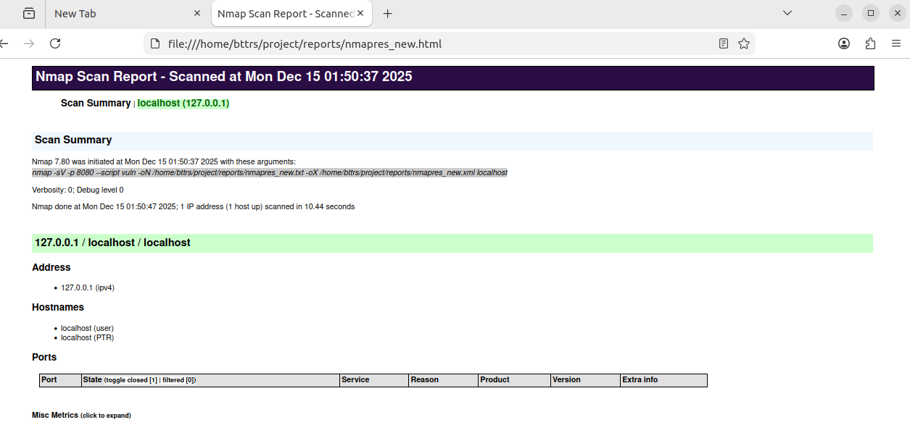

<div align="center">
<h1><a id="intro">Лабораторная работа №3</a><br></h1>
<a href="https://docs.github.com/en"></a>
<a href="https://daringfireball.net/projects/markdown"></a> 
<a href="https://symbl.cc/en/unicode-table"></a> 
<a href="https://shields.io"></a>
<a href="https://img.shields.io/badge/Risk_Analyze-2448a2"></a> </a> </a></div>


- [x] 1. Опишите используемые методы по их назначению, как они функционируют и какие результаты могут дать для оценки. Используйте сноску из материалов выше по флагам команд.

| Scan type            | nmap option      | Описание |
|----------------------|------------------|-----------|
| **TCP Connect**      | `-sT`            | Выполняет полное TCP-соединение для точного определения открытых и закрытых портов. |
| **TCP SYN (stealth)**| `-sS`            | Отправляет только SYN-пакет и анализирует ответ, позволяя определить состояние портов с меньшей заметностью. |
| **UDP Scan**         | `-sU`            | Посылает UDP-пакеты и по ICMP-ответам определяет наличие UDP-сервисов, часто давая неопределённый результат из-за фильтрации. |
| **TCP FIN**          | `-sF`            | Использует FIN-пакеты для обхода простых фильтров, различая закрытые и отфильтрованные порты. |
| **TCP ACK**          | `-sA`            | Отправляет ACK-пакеты для выявления фильтрации и наличия stateful-firewall, не определяя открытость порта. |
| **TCP Xmas Tree**    | `-sX`            | Применяет нестандартные TCP-флаги (FIN, PSH, URG) для анализа реакции хоста и обхода простых IDS. |
| **TCP NULL**         | `-sN`            | Отправляет пакеты без TCP-флагов, что позволяет выявить закрытые порты на некорректно настроенных системах. |
| **ICMP Ping Scan**   | `-sn`, `-PE/PP/PM` | Проверяет доступность хостов через ICMP-запросы без сканирования портов. |
| **FTP-Proxy Scan**   | (FTP proxy)      | Использует FTP-прокси для сканирования целевых хостов, маскируя источник трафика. |
| **Idle Scan**        | `-sI`            | Сканирует цель через «зомби-хост», анализируя IPID, обеспечивая высокую анонимность. |


- [x] 2. Выведите на терминале и проанализируйте следующие команды консоли

```bash
bttrs@bttrs:~/Riski/course_labs/labs/lab03/report$ nmap localhost
Starting Nmap 7.80 ( https://nmap.org ) at 2025-12-15 01:31 MSK
Nmap scan report for localhost (127.0.0.1)
Host is up (0.000067s latency).
Not shown: 998 closed ports
PORT    STATE SERVICE
22/tcp  open  ssh
631/tcp open  ipp

Nmap done: 1 IP address (1 host up) scanned in 0.09 seconds

bttrs@bttrs:~/Riski/course_labs/labs/lab03/report$ nmap -sC localhost
Starting Nmap 7.80 ( https://nmap.org ) at 2025-12-15 01:35 MSK
Nmap scan report for localhost (127.0.0.1)
Host is up (0.000065s latency).
Not shown: 998 closed ports
PORT    STATE SERVICE
22/tcp  open  ssh
631/tcp open  ipp
| http-robots.txt: 1 disallowed entry 
|_/
|_http-title: Home - CUPS 2.4.1

Nmap done: 1 IP address (1 host up) scanned in 0.85 seconds

bttrs@bttrs:~/Riski/course_labs/labs/lab03/report$ nmap -p localhost
Starting Nmap 7.80 ( https://nmap.org ) at 2025-12-15 01:35 MSK
Found no matches for the service mask 'localhost' and your specified protocols
QUITTING!

bttrs@bttrs:~/Riski/course_labs/labs/lab03/report$ nmap -O localhost
TCP/IP fingerprinting (for OS scan) requires root privileges.
QUITTING!

bttrs@bttrs:~/Riski/course_labs/labs/lab03/report$ nmap -p 80 localhost
Starting Nmap 7.80 ( https://nmap.org ) at 2025-12-15 01:36 MSK
Nmap scan report for localhost (127.0.0.1)
Host is up (0.00010s latency).

PORT   STATE  SERVICE
80/tcp closed http

Nmap done: 1 IP address (1 host up) scanned in 0.04 seconds

bttrs@bttrs:~/Riski/course_labs/labs/lab03/report$ nmap -p 443 localhost
Starting Nmap 7.80 ( https://nmap.org ) at 2025-12-15 01:36 MSK
Nmap scan report for localhost (127.0.0.1)
Host is up (0.00013s latency).

PORT    STATE  SERVICE
443/tcp closed https

Nmap done: 1 IP address (1 host up) scanned in 0.05 seconds

bttrs@bttrs:~/Riski/course_labs/labs/lab03/report$ nmap -p 8443 localhost
Starting Nmap 7.80 ( https://nmap.org ) at 2025-12-15 01:36 MSK
Nmap scan report for localhost (127.0.0.1)
Host is up (0.00021s latency).

PORT     STATE  SERVICE
8443/tcp closed https-alt

Nmap done: 1 IP address (1 host up) scanned in 0.04 seconds

bttrs@bttrs:~/Riski/course_labs/labs/lab03/report$ nmap -p "*" localhost
Starting Nmap 7.80 ( https://nmap.org ) at 2025-12-15 01:36 MSK
Nmap scan report for localhost (127.0.0.1)
Host is up (0.000064s latency).
Not shown: 8318 closed ports
PORT    STATE SERVICE
22/tcp  open  ssh
631/tcp open  ipp

Nmap done: 1 IP address (1 host up) scanned in 0.18 seconds

bttrs@bttrs:~/Riski/course_labs/labs/lab03/report$ nmap -sV -p 22,8080 localhost
Starting Nmap 7.80 ( https://nmap.org ) at 2025-12-15 01:36 MSK
Nmap scan report for localhost (127.0.0.1)
Host is up (0.00023s latency).

PORT     STATE  SERVICE    VERSION
22/tcp   open   ssh        OpenSSH 8.9p1 Ubuntu 3ubuntu0.13 (Ubuntu Linux; protocol 2.0)
8080/tcp closed http-proxy
Service Info: OS: Linux; CPE: cpe:/o:linux:linux_kernel

Service detection performed. Please report any incorrect results at https://nmap.org/submit/ .
Nmap done: 1 IP address (1 host up) scanned in 0.45 seconds

bttrs@bttrs:~/Riski/course_labs/labs/lab03/report$ nmap -sP 10.0.2.0/24
Starting Nmap 7.80 ( https://nmap.org ) at 2025-12-15 01:37 MSK
Nmap scan report for bttrs (10.0.2.15)
Host is up (0.000036s latency).
Nmap done: 256 IP addresses (1 host up) scanned in 2.48 seconds

bttrs@bttrs:~/Riski/course_labs/labs/lab03/report$ nmap --open 10.0.2.15
Starting Nmap 7.80 ( https://nmap.org ) at 2025-12-15 01:38 MSK
Nmap scan report for bttrs (10.0.2.15)
Host is up (0.000067s latency).
Not shown: 999 closed ports
PORT   STATE SERVICE
22/tcp open  ssh

Nmap done: 1 IP address (1 host up) scanned in 0.14 seconds

bttrs@bttrs:~/Riski/course_labs/labs/lab03/report$ nmap --packet-trace 10.0.2.15
...
CONN (0.1817s) TCP localhost > 10.0.2.15:3878 => Connection refused
CONN (0.1817s) TCP localhost > 10.0.2.15:4001 => Connection refused
CONN (0.1817s) TCP localhost > 10.0.2.15:9999 => Connection refused
Nmap scan report for bttrs (10.0.2.15)
Host is up (0.00017s latency).
Not shown: 999 closed ports
PORT   STATE SERVICE
22/tcp open  ssh

Nmap done: 1 IP address (1 host up) scanned in 0.18 seconds

bttrs@bttrs:~/Riski/course_labs/labs/lab03/report$ nmap --packet-trace scanme.nmap.org 
Starting Nmap 7.80 ( https://nmap.org ) at 2025-12-15 01:38 MSK
CONN (0.3513s) TCP localhost > 45.33.32.156:80 => Operation now in progress
CONN (0.3519s) TCP localhost > 45.33.32.156:443 => Operation now in progress
CONN (0.5566s) TCP localhost > 45.33.32.156:80 => Connected
NSOCK INFO [0.5580s] nsock_iod_new2(): nsock_iod_new (IOD #1)
...
Host is up (0.20s latency).
Other addresses for scanme.nmap.org (not scanned): 2600:3c01::f03c:91ff:fe18:bb2f
Not shown: 995 filtered ports
PORT      STATE  SERVICE
22/tcp    open   ssh
53/tcp    closed domain
80/tcp    open   http
9929/tcp  open   nping-echo
31337/tcp open   Elite

Nmap done: 1 IP address (1 host up) scanned in 13.58 seconds

bttrs@bttrs:~/Riski/course_labs/labs/lab03/report$ nmap --iflist
Starting Nmap 7.80 ( https://nmap.org ) at 2025-12-15 01:39 MSK
************************INTERFACES************************
DEV    (SHORT)  IP/MASK                                 TYPE     UP MTU   MAC
lo     (lo)     127.0.0.1/8                             loopback up 65536
lo     (lo)     ::1/128                                 loopback up 65536
enp0s3 (enp0s3) 10.0.2.15/24                            ethernet up 1500  08:00:27:53:9D:60
enp0s3 (enp0s3) fd17:625c:f037:2:7eaf:a754:5b2e:9151/64 ethernet up 1500  08:00:27:53:9D:60
enp0s3 (enp0s3) fe80::bfde:aeb9:2b64:79f7/64            ethernet up 1500  08:00:27:53:9D:60
enp0s3 (enp0s3) fd17:625c:f037:2:25c5:ee65:7c77:7e14/64 ethernet up 1500  08:00:27:53:9D:60

**************************ROUTES**************************
DST/MASK                                 DEV    METRIC GATEWAY
10.0.2.0/24                              enp0s3 100
169.254.0.0/16                           enp0s3 1000
0.0.0.0/0                                enp0s3 100    10.0.2.2
::1/128                                  lo     0
fd17:625c:f037:2:25c5:ee65:7c77:7e14/128 enp0s3 0
fd17:625c:f037:2:7eaf:a754:5b2e:9151/128 enp0s3 0
fe80::bfde:aeb9:2b64:79f7/128            enp0s3 0
::1/128                                  lo     256
fd17:625c:f037:2::/64                    enp0s3 100
fe80::/64                                enp0s3 1024
ff00::/8                                 enp0s3 256
::/0                                     enp0s3 20100  fe80::2

bttrs@bttrs:~/Riski/course_labs/labs/lab03/report$ nmap -iL scanme.nmap.org 
Failed to open input file scanme.nmap.org for reading
QUITTING!
bttrs@bttrs:~/Riski/course_labs/labs/lab03/report$ nmap -A -iL scanme.nmap.org 
Failed to open input file scanme.nmap.org for reading
QUITTING!
bttrs@bttrs:~/Riski/course_labs/labs/lab03/report$ nmap -sA scanme.nmap.org
You requested a scan type which requires root privileges.
QUITTING!
bttrs@bttrs:~/Riski/course_labs/labs/lab03/report$ nmap -PN scanme.nmap.org 
Starting Nmap 7.80 ( https://nmap.org ) at 2025-12-15 01:39 MSK
Nmap scan report for scanme.nmap.org (45.33.32.156)
Host is up (0.20s latency).
Other addresses for scanme.nmap.org (not scanned): 2600:3c01::f03c:91ff:fe18:bb2f
Not shown: 995 filtered ports
PORT      STATE  SERVICE
22/tcp    open   ssh
53/tcp    closed domain
80/tcp    open   http
9929/tcp  open   nping-echo
31337/tcp open   Elite

Nmap done: 1 IP address (1 host up) scanned in 14.55 seconds

bttrs@bttrs:~/Riski/course_labs/labs/lab03/report$ sudo nmap --script=vuln localhost -vv
Starting Nmap 7.80 ( https://nmap.org ) at 2025-12-15 01:43 MSK
NSE: Loaded 105 scripts for scanning.
NSE: Script Pre-scanning.
NSE: Starting runlevel 1 (of 2) scan.
Initiating NSE at 01:43
Completed NSE at 01:43, 10.00s elapsed
NSE: Starting runlevel 2 (of 2) scan.
Initiating NSE at 01:43
Completed NSE at 01:43, 0.00s elapsed
Initiating SYN Stealth Scan at 01:43
Scanning localhost (127.0.0.1) [1000 ports]
Discovered open port 22/tcp on 127.0.0.1
Discovered open port 631/tcp on 127.0.0.1
Completed SYN Stealth Scan at 01:43, 0.02s elapsed (1000 total ports)
NSE: Script scanning 127.0.0.1.
NSE: Starting runlevel 1 (of 2) scan.
Initiating NSE at 01:43
Stats: 0:00:23 elapsed; 0 hosts completed (1 up), 1 undergoing Script Scan
NSE: Active NSE Script Threads: 6 (4 waiting)
NSE Timing: About 96.95% done; ETC: 01:44 (0:00:00 remaining)
NSE Timing: About 97.97% done; ETC: 01:44 (0:00:01 remaining)
NSE Timing: About 97.97% done; ETC: 01:45 (0:00:02 remaining)
NSE Timing: About 97.97% done; ETC: 01:45 (0:00:02 remaining)
NSE Timing: About 97.97% done; ETC: 01:46 (0:00:03 remaining)
Stats: 0:02:47 elapsed; 0 hosts completed (1 up), 1 undergoing Script Scan
NSE: Active NSE Script Threads: 4 (3 waiting)
NSE Timing: About 97.97% done; ETC: 01:46 (0:00:03 remaining)
NSE Timing: About 97.97% done; ETC: 01:47 (0:00:04 remaining)
Stats: 0:03:37 elapsed; 0 hosts completed (1 up), 1 undergoing Script Scan
NSE: Active NSE Script Threads: 4 (3 waiting)
NSE Timing: About 97.97% done; ETC: 01:47 (0:00:04 remaining)

bttrs@bttrs:~/Riski/course_labs/labs/lab03/report$ nmap -sV -oN nmapres_new.txt localhost
Starting Nmap 7.80 ( https://nmap.org ) at 2025-12-15 01:49 MSK
Nmap scan report for localhost (127.0.0.1)
Host is up (0.000058s latency).
Not shown: 998 closed ports
PORT    STATE SERVICE VERSION
22/tcp  open  ssh     OpenSSH 8.9p1 Ubuntu 3ubuntu0.13 (Ubuntu Linux; protocol 2.0)
631/tcp open  ipp     CUPS 2.4
Service Info: OS: Linux; CPE: cpe:/o:linux:linux_kernel

Service detection performed. Please report any incorrect results at https://nmap.org/submit/ .
Nmap done: 1 IP address (1 host up) scanned in 6.38 seconds
bttrs@bttrs:~/Riski/course_labs/labs/lab03/report$ cat nmapres_new.txt 
# Nmap 7.80 scan initiated Mon Dec 15 01:49:33 2025 as: nmap -sV -oN nmapres_new.txt localhost
Nmap scan report for localhost (127.0.0.1)
Host is up (0.000058s latency).
Not shown: 998 closed ports
PORT    STATE SERVICE VERSION
22/tcp  open  ssh     OpenSSH 8.9p1 Ubuntu 3ubuntu0.13 (Ubuntu Linux; protocol 2.0)
631/tcp open  ipp     CUPS 2.4
Service Info: OS: Linux; CPE: cpe:/o:linux:linux_kernel

Service detection performed. Please report any incorrect results at https://nmap.org/submit/ .
# Nmap done at Mon Dec 15 01:49:39 2025 -- 1 IP address (1 host up) scanned in 6.38 seconds

bttrs@bttrs:~/Riski/course_labs/labs/lab03/report$ grep "VULNERABLE" nmapres_new.txt

bttrs@bttrs:~/Riski/course_labs/labs/lab03/report$ nmap -sV -p 8080 --script vuln -oN ~/project/reports/nmapres_new.txt -oX ~/project/reports/nmapres_new.xml localhost
Starting Nmap 7.80 ( https://nmap.org ) at 2025-12-15 01:50 MSK
Nmap scan report for localhost (127.0.0.1)
Host is up (0.00013s latency).

PORT     STATE  SERVICE    VERSION
8080/tcp closed http-proxy

Service detection performed. Please report any incorrect results at https://nmap.org/submit/ .
Nmap done: 1 IP address (1 host up) scanned in 10.44 seconds
```  
  


Анализ команд:  
1. `nmap localhost` — дефолтный TCP-скан топ-1000 портов показал, что на localhost открыты 22/tcp (SSH) и 631/tcp (IPP/CUPS), остальные из топа закрыты.
2. `nmap -sC localhost` — запустил “default scripts” NSE и дополнительно выявил HTTP-следы на 631 (CUPS), включая robots.txt и заголовок страницы “Home - CUPS 2.4.1”
3. `nmap -p localhost` — ошибка, потому что -p ждёт список портов, а localhost интерпретируется как “маска сервисов/портов” и не распознаётся.
4. `nmap -O localhost` — OS-детект требует root/RAW-сокеты, поэтому без sudo Nmap сразу завершился.
5. `nmap -p 80 localhost` — проверка конкретного порта показала 80/tcp closed, значит веб-сервис на 80 не слушает.
6. `nmap -p 443 localhost` — аналогично 443/tcp closed, HTTPS на стандартном порту отсутствует.
7. `nmap -p "*" localhost` — попытка просканировать всё, нашла те же 22 и 631, остальные были закрыты.
8. `nmap -sV -p 22,8080 localhost` — определение версий показало OpenSSH 8.9p1 на 22 и 8080 закрыт, т.е. прокси/веб на 8080 не работает
9. `nmap -sP 10.0.2.0/24` — “ping sweep” по подсети обнаружил только один живой хост (10.0.2.15), остальные не отвечали (либо выключены, либо фильтруют ICMP/ARP).
10. `nmap --open 10.0.2.15` — выводит только открытые порты и показал один открытый 22/tcp
11. `nmap --packet-trace 10.0.2.15` — включает трассировку пакетов и по Connection refused видно, что Nmap реально пытался подключаться к закрытым портам, что полезно для отладки фильтрации/маршрутизации.
12. `nmap --packet-trace scanme.nmap.org` — то же самое для внешней цели: видно установление соединения и итог, что часть портов filtered (вероятно, фильтр/фаервол), а некоторые open/closed.
13. `nmap --iflist` — выводит список интерфейсов, IP/MAC и маршруты
14. `nmap -PN scanme.nmap.org` — отключает ping-проверку и даёт результаты портов, где видно много filtered, что типично при межсетевом экране.
15. `sudo nmap --script=vuln localhost -vv` — запустил NSE-категорию vuln с подробностями, нашёл открытые 22 и 631
16. `nmap -sV -oN nmapres_new.txt localhost` — сделал версионный скан и сохранил результат в файл, где видно OpenSSH 8.9p1 и CUPS 2.4
17. `nmap -sV -p 8080 --script vuln -oN ~/project/reports/nmapres_new.txt -oX ~/project/reports/nmapres_new.xml localhost` - сканирование с записью в файл

- [x] 3. Используйте команду `tree` и выведите все вложенные файлы по директориям.
```bash
bttrs@bttrs:~/Riski/course_labs$ tree .
.
├── assets
│   └── logotype
│       ├── logo2.jpg
│       └── logo.jpg
├── CODE_OF_CONDUCT.md
├── CONTRIBUTING.md
├── docs
│   ├── about.md
│   ├── APPENDIX.md
│   ├── appsec_tt.md
│   ├── artifacts
│   │   ├── assets
│   │   │   ├── favicon.ico
│   │   │   ├── logo.png
│   │   │   └── logotypemd.jpg
│   │   ├── cheatsheet
│   │   │   ├── CHEATSHEET_DOCKERIGNORE.md
│   │   │   ├── CHEATSHEET_DOCKER.md
│   │   │   ├── CHEATSHEET_GH_CLI.md
│   │   │   ├── CHEATSHEET_GITIGNORE.md
│   │   │   └── CHEATSHEET_GIT.md
│   │   ├── exmpls
│   │   │   ├── risk-analysis.png
│   │   │   ├── table1.png
│   │   │   └── transaction.png
│   │   ├── owasp
│   │   │   ├── Authentication.pdf
│   │   │   ├── Authorization.pdf
│   │   │   ├── Client-side_Attacks.pdf
│   │   │   ├── Command_Execution.pdf
│   │   │   ├── Information_Disclosure.pdf
│   │   │   ├── Logical_Attacks.pdf
│   │   │   └── OWASP_Top_10_CICD_Risks.pdf
│   │   └── ppt
│   │       └── Лекция_Управление Рисками ИБ_intro.pdf
│   ├── Authentication.md
│   ├── Authorization.md
│   ├── channel.md
│   ├── Client-side Attacks.md
│   ├── Command Execution.md
│   ├── exmpl.md
│   ├── index.md
│   ├── Information Disclosure.md
│   ├── javascripts
│   │   ├── custom-title.js
│   │   └── typewriter-target.js
│   ├── labs
│   │   ├── lab01.md
│   │   ├── lab02.md
│   │   ├── lab03.md
│   │   ├── lab04.md
│   │   ├── lab05.md
│   │   ├── lab06.md
│   │   ├── lab07.md
│   │   ├── lab08.md
│   │   ├── lab09.md
│   │   ├── lab10.md
│   │   └── pet_project.md
│   ├── licenses.md
│   ├── Logical Attacks.md
│   ├── Multisignature.md
│   ├── OWASP_Top_10_CICD_Risks.md
│   ├── PrintNightmare.md
│   ├── RA.md
│   ├── RELEASE_NOTES.md
│   ├── robots.txt
│   ├── Security.md
│   └── stylesheets
│       ├── burger.css
│       ├── footer.css
│       ├── header.css
│       ├── layout.css
│       ├── mobile-logo.css
│       ├── search.css
│       ├── sidebar.css
│       ├── tools-overlay.css
│       └── typeset.css
├── eslint.config.js
├── labs
│   ├── lab01
│   │   ├── README.md
│   │   └── typersteel.py
│   ├── lab02
│   │   ├── exmpl_hello.py
│   │   ├── pygamesteel.py
│   │   └── README.md
│   ├── lab03
│   │   ├── exmp_targets.txt
│   │   ├── README.md
│   │   └── report
│   │       ├── img
│   │       │   └── 3-1.png
│   │       ├── nmapres_new.txt
│   │       └── README.md
│   ├── lab04
│   │   └── README.md
│   ├── lab05
│   │   ├── client
│   │   │   ├── client.py
│   │   │   ├── Dockerfile
│   │   │   └── requirements.txt
│   │   ├── docker-compose.yml
│   │   ├── README.md
│   │   ├── server
│   │   │   ├── app.py
│   │   │   ├── Dockerfile
│   │   │   └── requirements.txt
│   │   └── source
│   │       ├── Dockerfile
│   │       ├── hello.py
│   │       └── requirements.txt
│   ├── lab06
│   │   ├── audit.sh
│   │   ├── config
│   │   │   └── nginx.conf
│   │   ├── docker-compose.yml
│   │   ├── README.md
│   │   └── vulnerable-app.yml
│   ├── lab07
│   │   ├── cheat_check_yuorself.sh
│   │   ├── docker-compose.yml
│   │   ├── README.md
│   │   ├── sast
│   │   │   ├── checkov-config.yaml
│   │   │   └── semgrep-rules.yml
│   │   ├── sca
│   │   │   ├── dependency-check.sh
│   │   │   └── pom.xml
│   │   └── vulnerable-app
│   │       ├── app.py
│   │       ├── config.yaml
│   │       ├── Dockerfile
│   │       └── requirements.txt
│   ├── lab08
│   │   ├── dast
│   │   │   ├── convert_reports.py
│   │   │   ├── zap-baseline.conf
│   │   │   └── zap_scan.sh
│   │   ├── docker-compose.yml
│   │   ├── README.md
│   │   ├── requirements.txt
│   │   └── vulnerable-app
│   │       ├── app.py
│   │       ├── Dockerfile
│   │       ├── files
│   │       │   └── secret.txt
│   │       └── requirements.txt
│   ├── lab09
│   │   └── README.md
│   ├── lab10
│   │   └── README.md
│   └── pet_project
│       └── README.md
├── LICENSE.md
├── mkdocs.yml
├── mypy.ini
├── NOTICE.md
├── overrides
│   └── material
│       └── partials
│           └── toc.html
├── README.md
├── RELEASE_NOTES.md
├── requirements.txt
├── ruff.toml
├── SECURITY.md
└── stylelint.config.cjs

39 directories, 128 files
```
- [x] 4.Найдите IP сетевой карты `Ethernet`, которая соответствует вашей виртуальной машине используя `ifconfig` и выполните команду `nmap -sP inet_addr`

```bash
bttrs@bttrs:~/Riski/course_labs$ ifconfig
enp0s3: flags=4163<UP,BROADCAST,RUNNING,MULTICAST>  mtu 1500
        inet 10.0.2.15  netmask 255.255.255.0  broadcast 10.0.2.255
        inet6 fd17:625c:f037:2:7eaf:a754:5b2e:9151  prefixlen 64  scopeid 0x0<global>
        inet6 fe80::bfde:aeb9:2b64:79f7  prefixlen 64  scopeid 0x20<link>
        inet6 fd17:625c:f037:2:25c5:ee65:7c77:7e14  prefixlen 64  scopeid 0x0<global>
        ether 08:00:27:53:9d:60  txqueuelen 1000  (Ethernet)
        RX packets 1189409  bytes 1389792176 (1.3 GB)
        RX errors 0  dropped 0  overruns 0  frame 0
        TX packets 278873  bytes 58843004 (58.8 MB)
        TX errors 0  dropped 0 overruns 0  carrier 0  collisions 0

lo: flags=73<UP,LOOPBACK,RUNNING>  mtu 65536
        inet 127.0.0.1  netmask 255.0.0.0
        inet6 ::1  prefixlen 128  scopeid 0x10<host>
        loop  txqueuelen 1000  (Local Loopback)
        RX packets 352525  bytes 69361959 (69.3 MB)
        RX errors 0  dropped 0  overruns 0  frame 0
        TX packets 352525  bytes 69361959 (69.3 MB)
        TX errors 0  dropped 0 overruns 0  carrier 0  collisions 0
```

```bash
bttrs@bttrs:~/Riski/course_labs$ nmap -sP 10.0.2.0/24
Starting Nmap 7.80 ( https://nmap.org ) at 2025-12-15 02:05 MSK
Nmap scan report for bttrs (10.0.2.15)
Host is up (0.000044s latency).
Nmap done: 256 IP addresses (1 host up) scanned in 3.38 seconds
```

- [x] 5. Определите ОС, данные ssh, telnet  с помощью `nmap` и выведите о них информацию.
```bash
bttrs@bttrs:~/Riski/course_labs$ sudo nmap -A -p 22,23 10.0.2.0/24
Starting Nmap 7.80 ( https://nmap.org ) at 2025-12-15 02:06 MSK
Nmap scan report for _gateway (10.0.2.2)
Host is up (0.00045s latency).

PORT   STATE    SERVICE VERSION
22/tcp filtered ssh
23/tcp filtered telnet
MAC Address: 52:55:0A:00:02:02 (Unknown)
Warning: OSScan results may be unreliable because we could not find at least 1 open and 1 closed port
Aggressive OS guesses: GNU Hurd 0.3 (97%), Netgear WG602v1 WAP (Linux 2.2.14) (97%), ZKTeco F18 fingerprint reader (97%), TiVo series 1 (Sony SVR-2000 or Philips HDR112) (Linux 2.1.24-TiVo-2.5, PowerPC) (97%), Linux 2.2.13 (SuSE 6.3) (97%), Linux 2.2.5 - 2.2.14 (Red Hat 6.0 - 6.2) (97%), Linux 2.2.9 (97%), Compaq Tru64 UNIX 5.1B or HP OpenVMS 8.2 - 8.3 (96%), Aruba 200 wireless LAN controller (ArubaOS 3.3.2.5) (96%), Compaq Tru64 UNIX 5.1 or HP OpenVMS 7.3-2 (96%)
No exact OS matches for host (test conditions non-ideal).
Network Distance: 1 hop

TRACEROUTE
HOP RTT     ADDRESS
1   0.45 ms _gateway (10.0.2.2)

Nmap scan report for 10.0.2.3
Host is up (0.00027s latency).

PORT   STATE    SERVICE VERSION
22/tcp filtered ssh
23/tcp filtered telnet
MAC Address: 52:55:0A:00:02:03 (Unknown)
Too many fingerprints match this host to give specific OS details
Network Distance: 1 hop

TRACEROUTE
HOP RTT     ADDRESS
1   0.27 ms 10.0.2.3

Nmap scan report for bttrs (10.0.2.15)
Host is up (0.000040s latency).

PORT   STATE  SERVICE VERSION
22/tcp open   ssh     OpenSSH 8.9p1 Ubuntu 3ubuntu0.13 (Ubuntu Linux; protocol 2.0)
23/tcp closed telnet
Device type: general purpose
Running: Linux 2.6.X
OS CPE: cpe:/o:linux:linux_kernel:2.6.32
OS details: Linux 2.6.32
Network Distance: 0 hops
Service Info: OS: Linux; CPE: cpe:/o:linux:linux_kernel

OS and Service detection performed. Please report any incorrect results at https://nmap.org/submit/ .
Nmap done: 256 IP addresses (3 hosts up) scanned in 7.92 seconds
```

- [x] 6. Результаты из `nmapres_new.txt` надо перенести в `nmapres.txt` и оставить оба файла рядом в локальном репозитории. Желательно использовать `cp` в консоли через редактор.
```bash
bttrs@bttrs:~/Riski/course_labs/labs/lab03/report$ ls
img  nmapres_new.txt  README.md
bttrs@bttrs:~/Riski/course_labs/labs/lab03/report$ cp nmapres_new.txt nmapres.txt
bttrs@bttrs:~/Riski/course_labs/labs/lab03/report$ ls
img  nmapres_new.txt  nmapres.txt  README.md
```
- [x] 7. Оформить `README.md` по аналогии и использовать `shield`, etc.


- [x] 8. Составить `gist` отчет и отправить ссылку личным сообщением

***

Copyright (c) 2025 Egor Davydov