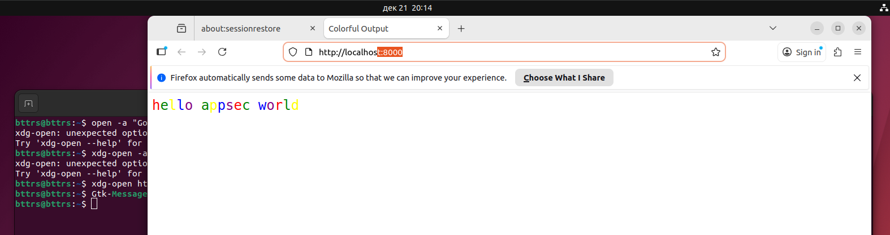

<div align="center">
<h1><a id="intro">Лабораторная работа №5</a><br></h1>
<a href="https://docs.github.com/en"></a>
<a href="https://daringfireball.net/projects/markdown"></a> 
<a href="https://symbl.cc/en/unicode-table"></a> 
<a href="https://shields.io"></a>
<a href="https://img.shields.io/badge/Risk_Analyze-2448a2"></a> </a> </a></div>

- [x] 1. Поставьте `Docker` и `buildkit`

```bash
bttrs@bttrs:~/Riski/course_labs/labs/lab05$ docker --version
Docker version 29.1.3, build f52814d

bttrs@bttrs:~/Riski/course_labs/labs/lab05$ sudo cat /etc/docker/daemon.json 
{
  "features": {
    "buildkit": true
  }
}
```

---

- [x] 2. Перейдите в `source` и выведите на терминале, далее проанализируйте следующие команды консоли

```bash
bttrs@bttrs:~/Riski/course_labs/labs/lab05/source$ docker buildx build -t hello-appsec-world .
[+] Building 45.3s (13/13) FINISHED                                                                                                                                                                               docker:default
 => [internal] load build definition from Dockerfile                                                                                                                                                                        0.1s
 => => transferring dockerfile: 429B                                                                                                                                                                                        0.0s
 => [internal] load metadata for docker.io/library/python:3.11-slim                                                                                                                                                         2.3s
 => [internal] load .dockerignore                                                                                                                                                                                           0.1s
 => => transferring context: 2B                                                                                                                                                                                             0.0s
 => [internal] load build context                                                                                                                                                                                           0.2s
 => => transferring context: 477B                                                                                                                                                                                           0.0s
 => [builder 1/4] FROM docker.io/library/python:3.11-slim@sha256:158caf0e080e2cd74ef2879ed3c4e697792ee65251c8208b7afb56683c32ea6c                                                                                          11.9s
 => => resolve docker.io/library/python:3.11-slim@sha256:158caf0e080e2cd74ef2879ed3c4e697792ee65251c8208b7afb56683c32ea6c                                                                                                   0.2s
 => => sha256:3f0cdbca744e7bd0ce0ff6da73b9148829b04309925992954a314ba203f56e99 249B / 249B                                                                                                                                  0.3s
 => => sha256:4d55cfecf3663813d03c369bcd532b89f41cf07b65d95887ef686538370a747c 14.36MB / 14.36MB                                                                                                                            4.1s
 => => sha256:72cf4c3b83019e176aba979aba419d35f56576bbcfc4f7249a1ab1d4b536730b 1.29MB / 1.29MB                                                                                                                              1.6s
 => => sha256:1733a4cd59540b3470ff7a90963bcdea5b543279dd6bdaf022d7883fdad221e5 29.78MB / 29.78MB                                                                                                                            6.4s
 => => extracting sha256:1733a4cd59540b3470ff7a90963bcdea5b543279dd6bdaf022d7883fdad221e5                                                                                                                                   2.9s
 => => extracting sha256:72cf4c3b83019e176aba979aba419d35f56576bbcfc4f7249a1ab1d4b536730b                                                                                                                                   0.2s
 => => extracting sha256:4d55cfecf3663813d03c369bcd532b89f41cf07b65d95887ef686538370a747c                                                                                                                                   1.9s
 => => extracting sha256:3f0cdbca744e7bd0ce0ff6da73b9148829b04309925992954a314ba203f56e99                                                                                                                                   0.1s
 => [builder 2/4] WORKDIR /hello                                                                                                                                                                                            0.4s
 => [builder 3/4] COPY requirements.txt .                                                                                                                                                                                   0.2s
 => [builder 4/4] RUN pip install --upgrade pip && pip wheel --wheel-dir=/wheels -r requirements.txt                                                                                                                        9.9s
 => [stage-1 3/6] COPY --from=builder /wheels /wheels                                                                                                                                                                       0.3s
 => [stage-1 4/6] COPY requirements.txt .                                                                                                                                                                                   0.2s
 => [stage-1 5/6] RUN pip install --no-index --find-links=/wheels -r requirements.txt                                                                                                                                       9.8s
 => [stage-1 6/6] COPY hello.py .                                                                                                                                                                                           0.5s
 => exporting to image                                                                                                                                                                                                      8.0s
 => => exporting layers                                                                                                                                                                                                     5.4s
 => => exporting manifest sha256:ccac073c6fe30b05f924a1ade081030cd590255d5e06fe84589f0924cadb7984                                                                                                                           0.1s
 => => exporting config sha256:7f3d3793a3e34deb64b7a8af18e970501ee379e80cb2f1ce90d1fe4dfc616756                                                                                                                             0.1s
 => => exporting attestation manifest sha256:795906269082e2ed5a6e84f654f3929e8a0da32bca5d07558a823802ba958507                                                                                                               0.2s
 => => exporting manifest list sha256:0d41c675ed556444b513069dae11e9012bfab363697bcdae0a3faa31af4f4249                                                                                                                      0.1s
 => => naming to docker.io/library/hello-appsec-world:latest                                                                                                                                                                0.0s
 => => unpacking to docker.io/library/hello-appsec-world:latest

bttrs@bttrs:~/Riski/course_labs/labs/lab05/source$ docker run hello-appsec-world
hello appsec world
bttrs@bttrs:~/Riski/course_labs/labs/lab05/source$ docker ps -a
CONTAINER ID   IMAGE                COMMAND             CREATED          STATUS                      PORTS     NAMES
5d0e8eae437c   hello-appsec-world   "python hello.py"   24 seconds ago   Exited (0) 15 seconds ago             agitated_hellman

bttrs@bttrs:~/Riski/course_labs/labs/lab05/source$ docker run --rm -it hello-appsec-world
hello appsec world

bttrs@bttrs:~/Riski/course_labs/labs/lab05/source$ docker load -i hello.tar
Loaded image: hello-appsec-world:latest
bttrs@bttrs:~/Riski/course_labs/labs/lab05/source$ docker load -i image.tar
Loaded image: hello-appsec-world:latest
bttrs@bttrs:~/Riski/course_labs/labs/lab05/source$ ls
Dockerfile  hello.py  hello.tar  requirements.txt
```

`docker buildx build -t hello-appsec-world .`. Сбррка образа
- **buildx build** - собрать Docker-образ с расширенным билдером buildx. В данном случае от `docker build -t hellow-appsec-world .` отличий нет. А так buildx использует **BuildKit** - новый движок сборки.
- **-t hello-appsec-world** -присвоить образу имя **hello-appsec-world**
- **.** - собрать из Dockerfile, который лежит в папке, в которой исполняется команда (в данном случае **~/Riski/course_labs/labs/lab05/source**)

`docker run hello-appsec-world`. Запуск контейнера
- Создание и запуск контейнера из образа **hello-appsec-world**
- Контейнер остается после завершения в списке контейнеров (через `docker ps -a`)

`docker run --rm -it hello-appsec-world`. Запуск контейнера
- **--rm** - автоматически удалить контейнер после завершения
- **-i** - интерактивый режим (держать STDIN открытым)
- **-t** - выделить псевдо терминал TTY

Разница в том, что после заверешния программы первая команда оставит контейнер, вторая удалит. Но **-it** можно использовать, когда мы хотим попасть внутрь контейнера с оболочкой

`docker save -o hello.tar hello-appsec-world`. Сохранение образа
- Сохраняет образ **hello-appsec-world** в файл *hello.tar*

`docker load -i hello.tar`. Загрузка образа
- Загружает образ из tar-архива

`docker load -i image.tar`. Загрузка образа

---

- [x] 3. Откройте `Dockerfile` и сделайте его анализ. Сделайте `commit`

```Dockerfile
FROM python:3.11-slim AS builder
WORKDIR /hello
COPY requirements.txt .
RUN pip install --upgrade pip && pip wheel --wheel-dir=/wheels -r requirements.txt

FROM python:3.11-slim 
WORKDIR /hello
COPY --from=builder /wheels /wheels 
COPY requirements.txt .
RUN pip install --no-index --find-links=/wheels -r requirements.txt
COPY hello.py .

ENV PYTHONUNBUFFERED=1
CMD ["python", "hello.py"]
```

- **FROM python:3.11-slim AS builder**. Используется образ **python:3.11-slim** с alias **builder**
- **WORKDIR /hello**. Рабочая директория, в которой будут выполняться команды
- **COPY requirements.txt**. Копирует файл из папки, в которой происходит сборка образа в контейнер
- **RUN pip install --upgrade pip && pip wheel --wheel-dir=/wheels -r requirements.txt**. Обновление pip, сборка wheel-пакетов в папку /wheels. Wheel - предкомпилированный формат, который быстрее устанавливается
- **COPY --from=builder /wheels /wheels**. Копирование всех wheel-файлов из стадии builder
- **RUN pip install --no-index --find-links=/wheels -r requirements.txt**. Выполнение команды. **--no-index** - без выхода в интернет. **--find-links=/wheels** - брать пакеты из локальной папки
- **COPY hello.py .**. Копирование кода в контейнер
- **ENV PYTHONUNBUFFERED=1**. Задаем env в контейнере, который отключает буферизацию вывода Python (чтобы видно было в `docker logs`)
- **CMD ["python", "hello.py"]**. Команда при запуске контйенера

---

- [x] 4. Замените в `Dockerfile` значение скрипта на `python` тем, который вы сделали ранее в прошлых лабораторных работах. Вложите свой файл `python` в директорию. Сделайте анализ своего измененного `Dockerfile` и внесите изменения. Сделайте commit.

```python
#!/usr/bin/env python3
"""Hello appsec world application.

Author: Butters7
"""

import typer

APP_NAME: str = "Hello appsec world"


def main(name: str = typer.Option(..., prompt="Enter your name")) -> None:
    """
    Greet the user with a personalized message.

    Args:
        name: The name of the user to greet.
    """
    print(f"{APP_NAME} from @{name}")


if __name__ == "__main__":
    typer.run(main)
```

```requirements.txt
typer>=0.9.0
```

```Dockerfile
FROM python:3.11-slim AS builder
WORKDIR /app
COPY requirements.txt .
RUN pip install --upgrade pip && pip wheel --wheel-dir=/wheels -r requirements.txt

FROM python:3.11-slim
WORKDIR /app
COPY --from=builder /wheels /wheels
COPY requirements.txt .
RUN pip install --no-index --find-links=/wheels -r requirements.txt && rm -rf /wheels
COPY hello.py .

ENV PYTHONUNBUFFERED=1
ENTRYPOINT ["python", "hello.py"]
```

По сути ничего нового не добавилось

```
bttrs@bttrs:~/Riski/course_labs/labs/lab05/helloapp$ docker buildx build -t helloapp .
[+] Building 41.1s (13/13) FINISHED                                                                                                                                                                               docker:default
 => [internal] load build definition from Dockerfile                                                                                                                                                                        0.3s
 => => transferring dockerfile: 448B                                                                                                                                                                                        0.1s
 => [internal] load metadata for docker.io/library/python:3.11-slim                                                                                                                                                         1.7s
 => [internal] load .dockerignore                                                                                                                                                                                           0.1s
 => => transferring context: 2B                                                                                                                                                                                             0.0s
 => [internal] load build context                                                                                                                                                                                           0.2s
 => => transferring context: 511B                                                                                                                                                                                           0.0s
 => CACHED [builder 1/4] FROM docker.io/library/python:3.11-slim@sha256:158caf0e080e2cd74ef2879ed3c4e697792ee65251c8208b7afb56683c32ea6c                                                                                    0.2s
 => => resolve docker.io/library/python:3.11-slim@sha256:158caf0e080e2cd74ef2879ed3c4e697792ee65251c8208b7afb56683c32ea6c                                                                                                   0.2s
 => [builder 2/4] WORKDIR /app                                                                                                                                                                                              0.1s
 => [builder 3/4] COPY requirements.txt .                                                                                                                                                                                   0.2s
 => [builder 4/4] RUN pip install --upgrade pip && pip wheel --wheel-dir=/wheels -r requirements.txt                                                                                                                       21.1s
 => [stage-1 3/6] COPY --from=builder /wheels /wheels                                                                                                                                                                       0.3s 
 => [stage-1 4/6] COPY requirements.txt .                                                                                                                                                                                   0.3s 
 => [stage-1 5/6] RUN pip install --no-index --find-links=/wheels -r requirements.txt && rm -rf /wheels                                                                                                                     8.4s 
 => [stage-1 6/6] COPY hello.py .                                                                                                                                                                                           0.4s
 => exporting to image                                                                                                                                                                                                      4.1s
 => => exporting layers                                                                                                                                                                                                     2.9s
 => => exporting manifest sha256:f5b71a78c9f3195624092e670241ce48ab81163019ab5215ba86c1ea99e1910e                                                                                                                           0.0s
 => => exporting config sha256:1ad0ca9547d929f3bbe2fefdad18dab0e168512c16df8779df876e0f8e6562e1                                                                                                                             0.0s
 => => exporting attestation manifest sha256:5e6c63816c775d4836eaef86e30c6d926cce9492c18d7e7266bd3d9fd0b8c275                                                                                                               0.1s
 => => exporting manifest list sha256:740183ce547251f34f98bc759fe37527b11a49f0230610bcef14d80dfbf44729                                                                                                                      0.0s
 => => naming to docker.io/library/helloapp:latest                                                                                                                                                                          0.0s
 => => unpacking to docker.io/library/helloapp:latest

bttrs@bttrs:~/Riski/course_labs/labs/lab05/helloapp$ docker run helloapp --name Butters7
Hello appsec world from @Butters7

bttrs@bttrs:~/Riski/course_labs$ git commit -S -m "feat(helloapp) Добавлен hello.py и Dockerfile"
[lab05 e224d9f] feat(helloapp) Добавлен hello.py и Dockerfile
 4 files changed, 49 insertions(+), 4 deletions(-)
 create mode 100644 labs/lab05/helloapp/Dockerfile
 create mode 100644 labs/lab05/helloapp/hello.py
 create mode 100644 labs/lab05/helloapp/requirements.txt
```

ID коммита `e224d9f`

---

- [x] 5. Выведите на терминале и проанализируйте следующие команды консоли. Сравните хеш сумму вашего архива с `image.tar` из репозитория, выведите на терминал.


```bash
bttrs@bttrs:~/Riski/course_labs/labs/lab05/helloapp$ docker save -o hello-appsec-world.tar hello-appsec-world:latest
bttrs@bttrs:~/Riski/course_labs/labs/lab05/helloapp$ docker save -o helloapp.tar helloapp:latest

bttrs@bttrs:~/Riski/course_labs/labs/lab05/helloapp$ sha256sum hello-appsec-world.tar helloapp.tar 
8fbc2e6bae198ef419d189fdfc67a6d2272990a352e2e973175ef24f1b55ec2e  hello-appsec-world.tar
cd2bbe6456a2543983db5762e22976552f5f2a49551d95c7548155ac2e1255da  helloapp.tar
```

---

- [x] 6. Доработайте свой `python` скрипт подключаемыми библиотеками, далее их необходимо разместить в `requirements.txt`.

```requirements.txt
typer>=0.9.0
flask==2.2.3
requests==2.28.1
```

```python
#!/usr/bin/env python3
"""Hello appsec world application.

Author: Butters7
"""

import typer
import requests
from flask import Flask

APP_NAME: str = "Hello appsec world"
app = Flask(__name__)


@app.route("/")
def index() -> str:
    """Return greeting message."""
    return f"{APP_NAME}!"


def main(name: str = typer.Option(..., prompt="Enter your name")) -> None:
    """
    Greet the user with a personalized message.

    Args:
        name: The name of the user to greet.
    """
    print(f"{APP_NAME} from @{name}")
    print(f"Flask version: {Flask.__name__}")
    print(f"Requests version: {requests.__version__}")


if __name__ == "__main__":
    typer.run(main)
```

---

- [x] 7. Сделайте `commit`. Повторите сборку приложения по вашему `Dockerfile` для доработанного скрипта python. Сохраните `image` в виде `.tar` архива. Сделайте `commit`.

```
bttrs@bttrs:~/Riski/course_labs$ git commit -S -m "feat(helloap) Добавил flask и requests и изменил логику работы"
[lab05 ea15f6d] feat(helloap) Добавил flask и requests и изменил логику работы
 2 files changed, 13 insertions(+)

bttrs@bttrs:~/Riski/course_labs/labs/lab05/helloapp$ docker buildx build -t helloapp .
[+] Building 33.6s (13/13) FINISHED                                                                                                                                                                               docker:default
 => [internal] load build definition from Dockerfile                                                                                                                                                                        0.1s
 => => transferring dockerfile: 448B                                                                                                                                                                                        0.0s
 => [internal] load metadata for docker.io/library/python:3.11-slim                                                                                                                                                         1.3s
 => [internal] load .dockerignore                                                                                                                                                                                           0.0s
 => => transferring context: 2B                                                                                                                                                                                             0.0s
 => [internal] load build context                                                                                                                                                                                           0.1s
 => => transferring context: 803B                                                                                                                                                                                           0.0s
 => [builder 1/4] FROM docker.io/library/python:3.11-slim@sha256:158caf0e080e2cd74ef2879ed3c4e697792ee65251c8208b7afb56683c32ea6c                                                                                           0.1s
 => => resolve docker.io/library/python:3.11-slim@sha256:158caf0e080e2cd74ef2879ed3c4e697792ee65251c8208b7afb56683c32ea6c                                                                                                   0.1s
 => CACHED [builder 2/4] WORKDIR /app                                                                                                                                                                                       0.0s
 => [builder 3/4] COPY requirements.txt .                                                                                                                                                                                   0.2s
 => [builder 4/4] RUN pip install --upgrade pip && pip wheel --wheel-dir=/wheels -r requirements.txt                                                                                                                       18.4s
 => [stage-1 3/6] COPY --from=builder /wheels /wheels                                                                                                                                                                       0.3s 
 => [stage-1 4/6] COPY requirements.txt .                                                                                                                                                                                   0.3s 
 => [stage-1 5/6] RUN pip install --no-index --find-links=/wheels -r requirements.txt && rm -rf /wheels                                                                                                                     6.9s 
 => [stage-1 6/6] COPY hello.py .                                                                                                                                                                                           0.4s
 => exporting to image                                                                                                                                                                                                      4.5s
 => => exporting layers                                                                                                                                                                                                     3.2s
 => => exporting manifest sha256:96c1918b8389ecd9625b941e92d3cae5fb4170247dbecb5548d0a3a42688b258                                                                                                                           0.0s
 => => exporting config sha256:2ff62c03f26cbb1901f00a0dedd3f8df9903e1f59ac2879a144f5d323f91172f                                                                                                                             0.0s
 => => exporting attestation manifest sha256:42ecdf1c9048f6a4914e4f1c37b5c78b16ed44b206ff686317b10ee22c06a4df                                                                                                               0.1s
 => => exporting manifest list sha256:f0048ad734f30b846aca8aab67dd2d70d8ee79567a45efbc5e1d9b31e3083364                                                                                                                      0.0s
 => => naming to docker.io/library/helloapp:latest                                                                                                                                                                          0.0s
 => => unpacking to docker.io/library/helloapp:latest

bttrs@bttrs:~/Riski/course_labs/labs/lab05/helloapp$ docker run --rm -it helloapp
Enter your name: Egor
Hello appsec world from @Egor
Flask version: Flask
Requests version: 2.28.1

bttrs@bttrs:~/Riski/course_labs/labs/lab05/helloapp$ docker save -o helloapp.tar helloapp:latest

bttrs@bttrs:~/Riski/course_labs/labs/lab05/helloapp$ ls -lah helloapp.tar 
-rw------- 1 bttrs bttrs 56M дек 21 19:42 helloapp.tar
```

---

- [x] 8. Выведите на терминале и проанализируйте следующие команды консоли

```bash
bttrs@bttrs:~/Riski/course_labs/labs/lab05/helloapp$ docker login

USING WEB-BASED LOGIN

i Info → To sign in with credentials on the command line, use 'docker login -u <username>'
         

Your one-time device confirmation code is: JXRZ-LVKX
Press ENTER to open your browser or submit your device code here: https://login.docker.com/activate

Waiting for authentication in the browser…

WARNING! Your credentials are stored unencrypted in '/home/bttrs/.docker/config.json'.
Configure a credential helper to remove this warning. See
https://docs.docker.com/go/credential-store/

Login Succeeded

bttrs@bttrs:~/Riski/course_labs/labs/lab05/helloapp$ docker tag hello-appsec-world butters192/hello-appsec-world

bttrs@bttrs:~/Riski/course_labs/labs/lab05/helloapp$ docker push butters192/hello-appsec-world:latest 
The push refers to repository [docker.io/butters192/hello-appsec-world]
023b93dae156: Pushed 
80ec1d63a9d2: Pushed 
1733a4cd5954: Pushed 
72cf4c3b8301: Pushed 
604c956a9881: Pushed 
4d55cfecf366: Pushed 
3f0cdbca744e: Pushed 
c58f7b24340b: Pushed 
c242b4701cb0: Pushed 
ff7957fdb0af: Pushed 
latest: digest: sha256:0d41c675ed556444b513069dae11e9012bfab363697bcdae0a3faa31af4f4249 size: 856

bttrs@bttrs:~/Riski/course_labs/labs/lab05/helloapp$ docker inspect butters192/hello-appsec-world
[
    {
        "Id": "sha256:0d41c675ed556444b513069dae11e9012bfab363697bcdae0a3faa31af4f4249",
        "RepoTags": [
            "butters192/hello-appsec-world:latest",
            "hello-appsec-world:latest"
        ],
        "RepoDigests": [
            "butters192/hello-appsec-world@sha256:0d41c675ed556444b513069dae11e9012bfab363697bcdae0a3faa31af4f4249",
            "hello-appsec-world@sha256:0d41c675ed556444b513069dae11e9012bfab363697bcdae0a3faa31af4f4249"
        ],
        "Comment": "buildkit.dockerfile.v0",
        "Created": "2025-12-21T18:34:13.071035809+03:00",
        "Config": {
            "Env": [
                "PATH=/usr/local/bin:/usr/local/sbin:/usr/local/bin:/usr/sbin:/usr/bin:/sbin:/bin",
                "LANG=C.UTF-8",
                "GPG_KEY=A035C8C19219BA821ECEA86B64E628F8D684696D",
                "PYTHON_VERSION=3.11.14",
                "PYTHON_SHA256=8d3ed8ec5c88c1c95f5e558612a725450d2452813ddad5e58fdb1a53b1209b78",
                "PYTHONUNBUFFERED=1"
            ],
            "Cmd": [
                "python",
                "hello.py"
            ],
            "WorkingDir": "/hello",
            "ArgsEscaped": true
        },
        "Architecture": "amd64",
        "Os": "linux",
        "Size": 49508258,
        "RootFS": {
            "Type": "layers",
            "Layers": [
                "sha256:77a2b55fbe8b9984ce0af3ffc0b0ab62507668e63306ec161a585e587a3eb164",
                "sha256:424dc4972605239ec660864fe4cc7bcf6ebdadd752a7ee7ad065a83c34798378",
                "sha256:600af8de593b464a3642857b2dce39ad42474145771745962fb90ea9c276fa9d",
                "sha256:fa384bf02ac198a84ae5f0bbe085a6e4bd2de0be1b595833ba52e9780a936ba9",
                "sha256:bc38a44fffe93d489e0e3fa022f2359c34fcfd5c0469564726745775d93dd170",
                "sha256:01f37784212cbc530112ecf83a9c54526958854f68015c249151ed93e9928e2b",
                "sha256:00283ee23a5b590a025eb66068c44d1bc3979a08b321f5e837555763f3fe3c1c",
                "sha256:d9dc1e8a38749948219ad690c38ee06601dddcb02786797af33aafe900924326",
                "sha256:96451000bf9747766cc440fe7b30d479adcacc126706b0b7906c895cec32dde7"
            ]
        },
        "Metadata": {
            "LastTagTime": "2025-12-21T16:47:32.202564872Z"
        },
        "Descriptor": {
            "mediaType": "application/vnd.oci.image.index.v1+json",
            "digest": "sha256:0d41c675ed556444b513069dae11e9012bfab363697bcdae0a3faa31af4f4249",
            "size": 856,
            "annotations": {
                "io.containerd.image.name": "docker.io/library/hello-appsec-world:latest",
                "org.opencontainers.image.ref.name": "latest"
            }
        }
    }
]

bttrs@bttrs:~/Riski/course_labs/labs/lab05/helloapp$ docker container create --name first hello-appsec-world
0cdbae2049fd6491f51785f8fdcae945aa6b046a91f47f335cca42d66e4d374f

bttrs@bttrs:~/Riski/course_labs/labs/lab05/helloapp$ docker image pull geminishkv/hello-appsec-world
Using default tag: latest
Error response from daemon: pull access denied for geminishkv/hello-appsec-world, repository does not exist or may require 'docker login'
```

`docker login`. Авторизация в docker hub

`docker tag hello-appsec-world butters192/hello-appsec-world`. Создание нового имени для образа, чтобы запушить в свой репозиторий на docker hub

`docker push butters192/hello-appsec-world`. Загружает образ в Docker Hub. Он доступен публично

`docker inspect butters192/hello-appsec-world`. Показываем полную информацию об образе
- **Id** - уникальный sha256 хеш
- **RepoTags** - все теги образа
- **Config** - переменные окружения, CMD, рабочая директория
- **Layers** - слои образа (чтобы не собирать по 100500 раз одинаковые слои)
- **Size** - размер образа

`docker container create --name first hello-appsec-world`. Создание контейнера без запуска с именем `first`. Возвращает ID контейнера

`geminishkv/hello-appsec-world` образа нет, поэтому дальнейшие команды нет смысла исполнять. А так `pull` загрузит образ из публичного docker hub пользователя `geminishkv`.

Дали образ image.tar (аналог `geminishkv/hello-appsec-world`), но он неподдерживыемый
```
bttrs@bttrs:~/Riski/course_labs/labs/lab05/source$ docker run hello-appsec-world:latest 
WARNING: The requested image's platform (linux/arm64) does not match the detected host platform (linux/amd64/v2) and no specific platform was requested
exec /usr/local/bin/python: exec format error
```

---

- [x] 9. Выведите на терминале и проанализируйте в консоли процессы, которые запущены, владельцев по пользователям

```
bttrs@bttrs:~/Riski/course_labs/labs/lab05/source$ docker container run -it ubuntu /bin/bash
Unable to find image 'ubuntu:latest' locally
latest: Pulling from library/ubuntu
20043066d3d5: Pull complete 
06808451f0d6: Download complete 
Digest: sha256:c35e29c9450151419d9448b0fd75374fec4fff364a27f176fb458d472dfc9e54
Status: Downloaded newer image for ubuntu:latest
root@d1f4fcdbdfbf:/# ps aux
USER         PID %CPU %MEM    VSZ   RSS TTY      STAT START   TIME COMMAND
root           1  0.0  0.1   4588  3840 pts/0    Ss   17:09   0:00 /bin/bash
root           9  0.0  0.1   7888  3968 pts/0    R+   17:09   0:00 ps aux
root@d1f4fcdbdfbf:/# whoami
root
root@d1f4fcdbdfbf:/# id
uid=0(root) gid=0(root) groups=0(root)
```

Внутри контейнера работает только `bash` (PID 1) от пользователя `root`

---

- [x] 10. Выведите оба контейнера first и second на терминал
```
bttrs@bttrs:~/Riski/course_labs/labs/lab05/source$ docker ps -a
CONTAINER ID   IMAGE                                  COMMAND             CREATED              STATUS                     PORTS     NAMES
d1f4fcdbdfbf   ubuntu                                 "/bin/bash"         About a minute ago   Exited (0) 3 seconds ago             priceless_colden
efa79fbb6079   butters192/hello-appsec-world:latest   "python hello.py"   2 minutes ago        Created                              first
44f77f9e3c4c   hellow-appsec-world                    "python hello.py"   3 minutes ago        Created                              second
```

- [x] 11. Перейдите в основной корень lab05 и выведите на терминале, и проанализируйте
```
bttrs@bttrs:~/Riski/course_labs/labs/lab05$ docker compose up --build
WARN[0000] /home/bttrs/Riski/course_labs/labs/lab05/docker-compose.yml: the attribute `version` is obsolete, it will be ignored, please remove it to avoid potential confusion 
[+] Building 40.6s (27/27) FINISHED                                                                                                                                                                                              
 => [internal] load local bake definitions                                                                                                                                                                                  0.0s
 => => reading from stdin 997B                                                                                                                                                                                              0.0s
 => [client internal] load build definition from Dockerfile                                                                                                                                                                 0.1s
 => => transferring dockerfile: 425B                                                                                                                                                                                        0.0s
 => [server internal] load build definition from Dockerfile                                                                                                                                                                 0.1s
 => => transferring dockerfile: 419B                                                                                                                                                                                        0.0s
 => [server internal] load metadata for docker.io/library/python:3.11-slim                                                                                                                                                  1.2s
 => [auth] library/python:pull token for registry-1.docker.io                                                                                                                                                               0.0s
 => [server internal] load .dockerignore                                                                                                                                                                                    0.2s
 => => transferring context: 2B                                                                                                                                                                                             0.0s
 => [client internal] load .dockerignore                                                                                                                                                                                    0.1s
 => => transferring context: 2B                                                                                                                                                                                             0.0s
 => [client internal] load build context                                                                                                                                                                                    0.2s
 => => transferring context: 576B                                                                                                                                                                                           0.0s
 => [server builder 1/4] FROM docker.io/library/python:3.11-slim@sha256:158caf0e080e2cd74ef2879ed3c4e697792ee65251c8208b7afb56683c32ea6c                                                                                    0.2s
 => => resolve docker.io/library/python:3.11-slim@sha256:158caf0e080e2cd74ef2879ed3c4e697792ee65251c8208b7afb56683c32ea6c                                                                                                   0.2s
 => [server internal] load build context                                                                                                                                                                                    0.2s
 => => transferring context: 842B                                                                                                                                                                                           0.0s
 => CACHED [server builder 2/4] WORKDIR /app                                                                                                                                                                                0.0s
 => [client builder 3/4] COPY requirements.txt .                                                                                                                                                                            0.3s
 => [server builder 3/4] COPY requirements.txt .                                                                                                                                                                            0.3s
 => [client builder 4/4] RUN pip install --upgrade pip && pip wheel --wheel-dir=/wheels -r requirements.txt                                                                                                                19.0s
 => [server builder 4/4] RUN pip install --upgrade pip && pip wheel --wheel-dir=/wheels -r requirements.txt                                                                                                                20.0s
 => [client stage-1 3/6] COPY --from=builder /wheels /wheels                                                                                                                                                                0.5s
 => [server stage-1 3/6] COPY --from=builder /wheels /wheels                                                                                                                                                                0.4s
 => [server stage-1 4/6] COPY requirements.txt .                                                                                                                                                                            0.4s
 => [client stage-1 4/6] COPY requirements.txt .                                                                                                                                                                            0.5s
 => [server stage-1 5/6] RUN pip install --no-index --find-links=/wheels -r requirements.txt                                                                                                                                9.6s
 => [client stage-1 5/6] RUN pip install --no-index --find-links=/wheels -r requirements.txt                                                                                                                                8.8s
 => [client stage-1 6/6] COPY client.py .                                                                                                                                                                                   1.0s
 => [server stage-1 6/6] COPY app.py .                                                                                                                                                                                      0.8s
 => [client] exporting to image                                                                                                                                                                                             5.4s
 => => exporting layers                                                                                                                                                                                                     3.8s
 => => exporting manifest sha256:500992c149fbdff27476180874ccddc9301e8a45267aac1cb574421de6ad4367                                                                                                                           0.1s
 => => exporting config sha256:f94684fb2746741635ae962e514782dcfc274c24d03542653b2359c6f532f4ed                                                                                                                             0.1s
 => => exporting attestation manifest sha256:b19aa5bcccf7a18231147e6607ae480bf90d0e205fa6d48529be51cffb628549                                                                                                               0.1s
 => => exporting manifest list sha256:03ef9aa4af1672295c992d92abe9b6ccec4ed6b566036f2e5f7e1cedef0dc487                                                                                                                      0.1s
 => => naming to docker.io/library/lab05-client:latest                                                                                                                                                                      0.0s
 => => unpacking to docker.io/library/lab05-client:latest                                                                                                                                                                   1.0s
 => [server] exporting to image                                                                                                                                                                                             5.2s
 => => exporting layers                                                                                                                                                                                                     3.6s
 => => exporting manifest sha256:a833ce19cfc0fa98731c7daf6f5d579eb4ade3082d77579c381118a9ada8f9d1                                                                                                                           0.1s
 => => exporting config sha256:00112b64dad5c7e58bd1ad6ca1d5f65c7d61cd0cb1bf4fd39da5c545177dae89                                                                                                                             0.1s
 => => exporting attestation manifest sha256:e7162689a94a4ba7875225d4a6b0c822d6a5fda3a6de102963424d53b071d786                                                                                                               0.1s
 => => exporting manifest list sha256:d1c80f774322c734967e9d65fd989dfbcd887d55a1ffc82828de803ddf1b4243                                                                                                                      0.1s
 => => naming to docker.io/library/lab05-server:latest                                                                                                                                                                      0.0s
 => => unpacking to docker.io/library/lab05-server:latest                                                                                                                                                                   1.1s
 => [client] resolving provenance for metadata file                                                                                                                                                                         0.1s
 => [server] resolving provenance for metadata file                                                                                                                                                                         0.0s
[+] up 5/5
 ✔ Image lab05-client       Built                                                                                                                                                                                          40.7s 
 ✔ Image lab05-server       Built                                                                                                                                                                                          40.7s 
 ✔ Network lab05_app_net    Created                                                                                                                                                                                         0.3s 
 ✔ Container lab05-server-1 Created                                                                                                                                                                                         0.8s 
 ✔ Container lab05-client-1 Created                                                                                                                                                                                         0.2s 
Attaching to client-1, server-1
server-1  |  * Serving Flask app 'app'
server-1  |  * Debug mode: off
server-1  | WARNING: This is a development server. Do not use it in a production deployment. Use a production WSGI server instead.
server-1  |  * Running on all addresses (0.0.0.0)
server-1  |  * Running on http://127.0.0.1:8000
server-1  |  * Running on http://172.18.0.2:8000
server-1  | Press CTRL+C to quit
server-1  | 172.18.0.3 - - [21/Dec/2025 17:12:11] "GET / HTTP/1.1" 200 -
client-1  | 
client-1  |     <html>
client-1  |     <head><title>Colorful Output</title></head>
```  

---

- [x] 12. Откройте соседнее окно терминала и и выведите на терминале  



---

- [x] 13. Остановите работу `docker-compose`.

```
bttrs@bttrs:~/Riski/course_labs/labs/lab05$ docker ps -a
CONTAINER ID   IMAGE                                  COMMAND              CREATED         STATUS                          PORTS     NAMES
d14d3f18629f   lab05-client                           "python client.py"   4 minutes ago   Exited (0) About a minute ago             lab05-client-1
35dc55eda6a8   lab05-server                           "python app.py"      4 minutes ago   Exited (137) 54 seconds ago               lab05-server-1
d1f4fcdbdfbf   ubuntu                                 "/bin/bash"          7 minutes ago   Exited (0) 5 minutes ago                  priceless_colden
efa79fbb6079   butters192/hello-appsec-world:latest   "python hello.py"    8 minutes ago   Created                                   first
44f77f9e3c4c   hellow-appsec-world                    "python hello.py"    9 minutes ago   Created                                   second
bttrs@bttrs:~/Riski/course_labs/labs/lab05$ docker ps -q
bttrs@bttrs:~/Riski/course_labs/labs/lab05$ docker images
                                                                                                                                                                                                             i Info →   U  In Use
IMAGE                                  ID             DISK USAGE   CONTENT SIZE   EXTRA
butters192/hello-appsec-world:latest   0d41c675ed55        203MB         49.5MB    U   
helloapp:latest                        b543f54203e7        238MB         58.6MB        
hellow-appsec-world:latest             59ea2fd867e6        203MB         49.5MB    U   
lab05-client:latest                    03ef9aa4af16        208MB         50.9MB    U   
lab05-server:latest                    d1c80f774322        211MB         51.8MB    U   
ubuntu:latest                          c35e29c94501        119MB         31.7MB    U   
bttrs@bttrs:~/Riski/course_labs/labs/lab05$ docker compose down
WARN[0000] /home/bttrs/Riski/course_labs/labs/lab05/docker-compose.yml: the attribute `version` is obsolete, it will be ignored, please remove it to avoid potential confusion 
[+] down 2/3
 ✔ Container lab05-client-1 Removed                                                                                                                                                                                         0.7s 
 ✔ Container lab05-server-1 Removed                                                                                                                                                                                         0.2s 
 ⠏ Network lab05_app_net    Removing 
```

---

- [x] 14. Доработайте `docker compose` и скрипт, который вы подготовили ранее, что бы вы смогли воспроизвести шаги п.11 по п.13 с демонстрацией. Сделайте `commit`.

```
bttrs@bttrs:~/Riski/course_labs/labs/lab05/helloapp$ tree
.
├── client
│   ├── client.py
│   ├── Dockerfile
│   └── requirements.txt
├── docker-compose.yml
├── Dockerfile
├── hello.py
├── requirements.txt
└── server
    ├── app.py
    ├── Dockerfile
    └── requirements.txt

2 directories, 10 files

bttrs@bttrs:~/Riski/course_labs/labs/lab05/helloapp$ cat docker-compose.yml 
networks:
  app_net:

services:
  server:
    build: ./server
    ports:
      - "8000:8000"
    networks:
      - app_net
    environment:
      - GREETING_NAME=Butters7
    command: python app.py

  client:
    build: ./client
    depends_on:
      - server
    networks:
      - app_net
    command: python client.py
```

- Server — Flask сервер на порту 8000, выводит "Hello appsec world from @Butters7" с цветным текстом
- Client — делает запрос к серверу и выводит ответ в терминал

```
bttrs@bttrs:~/Riski/course_labs/labs/lab05/helloapp$ docker compose up --build
[+] Building 5.0s (27/27) FINISHED                                                                                                                                                                            
 => [internal] load local bake definitions                                                                                                                                                               0.0s
 => => reading from stdin 1.04kB                                                                                                                                                                         0.0s
 => [server internal] load build definition from Dockerfile                                                                                                                                              0.1s
 => => transferring dockerfile: 437B                                                                                                                                                                     0.1s
 => [client internal] load build definition from Dockerfile                                                                                                                                              0.1s
 => => transferring dockerfile: 443B                                                                                                                                                                     0.0s
 => [server internal] load metadata for docker.io/library/python:3.11-slim                                                                                                                               1.7s
 => [auth] library/python:pull token for registry-1.docker.io                                                                                                                                            0.0s
 => [server internal] load .dockerignore                                                                                                                                                                 0.0s
 => => transferring context: 2B                                                                                                                                                                          0.0s
 => [client internal] load .dockerignore                                                                                                                                                                 0.0s
 => => transferring context: 2B                                                                                                                                                                          0.0s
 => [server internal] load build context                                                                                                                                                                 0.1s
 => => transferring context: 1.36kB                                                                                                                                                                      0.0s
 => [client builder 1/4] FROM docker.io/library/python:3.11-slim@sha256:158caf0e080e2cd74ef2879ed3c4e697792ee65251c8208b7afb56683c32ea6c                                                                 0.2s
 => => resolve docker.io/library/python:3.11-slim@sha256:158caf0e080e2cd74ef2879ed3c4e697792ee65251c8208b7afb56683c32ea6c                                                                                0.1s
 => [client internal] load build context                                                                                                                                                                 0.1s
 => => transferring context: 699B                                                                                                                                                                        0.0s
 => CACHED [client builder 2/4] WORKDIR /app                                                                                                                                                             0.0s
 => CACHED [server builder 3/4] COPY requirements.txt .                                                                                                                                                  0.0s
 => CACHED [server builder 4/4] RUN pip install --upgrade pip && pip wheel --wheel-dir=/wheels -r requirements.txt                                                                                       0.0s
 => CACHED [server stage-1 3/6] COPY --from=builder /wheels /wheels                                                                                                                                      0.0s
 => CACHED [server stage-1 4/6] COPY requirements.txt .                                                                                                                                                  0.0s
 => CACHED [server stage-1 5/6] RUN pip install --no-index --find-links=/wheels -r requirements.txt && rm -rf /wheels                                                                                    0.0s
 => [server stage-1 6/6] COPY app.py .                                                                                                                                                                   0.6s
 => CACHED [client builder 3/4] COPY requirements.txt .                                                                                                                                                  0.0s
 => CACHED [client builder 4/4] RUN pip install --upgrade pip && pip wheel --wheel-dir=/wheels -r requirements.txt                                                                                       0.0s
 => CACHED [client stage-1 3/6] COPY --from=builder /wheels /wheels                                                                                                                                      0.0s
 => CACHED [client stage-1 4/6] COPY requirements.txt .                                                                                                                                                  0.0s
 => CACHED [client stage-1 5/6] RUN pip install --no-index --find-links=/wheels -r requirements.txt && rm -rf /wheels                                                                                    0.0s
 => [client stage-1 6/6] COPY client.py .                                                                                                                                                                0.5s
 => [client] exporting to image                                                                                                                                                                          1.1s
 => => exporting layers                                                                                                                                                                                  0.4s
 => => exporting manifest sha256:e1c092d02afe204bdebb353b877f46ddd9cca6f35466d441be7032a08f4c9479                                                                                                        0.1s
 => => exporting config sha256:a393fb434d074ac7f86053cea07c3ce558e60c81c1ea8bf9cb3f5e1ba39604c3                                                                                                          0.1s
 => => exporting attestation manifest sha256:bf2aa465f5e733e3b4eeaeca290d363625820b50a1f9c1d6d01039471d585be8                                                                                            0.1s
 => => exporting manifest list sha256:f18fd24672770852f238b3fe2d3c0be9293b128bd80183a3164a96bf3c20a274                                                                                                   0.1s
 => => naming to docker.io/library/helloapp-client:latest                                                                                                                                                0.0s
 => => unpacking to docker.io/library/helloapp-client:latest                                                                                                                                             0.2s
 => [server] exporting to image                                                                                                                                                                          1.1s
 => => exporting layers                                                                                                                                                                                  0.5s
 => => exporting manifest sha256:0140964da157f94755934e77e93d0c16b9bd427fc922daec589024521f34a06d                                                                                                        0.1s
 => => exporting config sha256:20d4d65b751458e81306858a3e60ab1a0412d68f9dc13441bdd6f8332c833a32                                                                                                          0.1s
 => => exporting attestation manifest sha256:0dcaa764545aeeb6d49a1697f1fe1416f589e00cec07217b77474d84d0ff95a2                                                                                            0.1s
 => => exporting manifest list sha256:3599c5db0eb5330ca3a2124c4c30a24708504d654194d1170f5df42c12dccb32                                                                                                   0.1s
 => => naming to docker.io/library/helloapp-server:latest                                                                                                                                                0.0s
 => => unpacking to docker.io/library/helloapp-server:latest                                                                                                                                             0.1s
 => [client] resolving provenance for metadata file                                                                                                                                                      0.0s
 => [server] resolving provenance for metadata file                                                                                                                                                      0.0s
[+] up 4/4
 ✔ Image helloapp-client       Built                                                                                                                                                                     5.1s 
 ✔ Image helloapp-server       Built                                                                                                                                                                     5.1s 
 ✔ Container helloapp-server-1 Recreated                                                                                                                                                                 0.4s 
 ✔ Container helloapp-client-1 Recreated                                                                                                                                                                 0.3s 
Attaching to client-1, server-1
server-1  |  * Serving Flask app 'app'
server-1  |  * Debug mode: off
server-1  | WARNING: This is a development server. Do not use it in a production deployment. Use a production WSGI server instead.
server-1  |  * Running on all addresses (0.0.0.0)
server-1  |  * Running on http://127.0.0.1:8000
server-1  |  * Running on http://172.18.0.2:8000
server-1  | Press CTRL+C to quit
server-1  | 172.18.0.3 - - [21/Dec/2025 17:58:56] "GET /api HTTP/1.1" 200 -
client-1  | Hello appsec world from @Butters7
client-1 exited with code 0
```

---

- [x] 15. Залейте изменения в свой удаленный репозиторий, проверьте историю commit.

```
bttrs@bttrs:~/Riski/course_labs$ git commit -S -m "feat(compose helloapp) Добавил клиент-сервер для docker compose helloap приложения"
[lab05 b932ca3] feat(compose helloapp) Добавил клиент-сервер для docker compose helloap приложения
 7 files changed, 130 insertions(+)
 create mode 100644 labs/lab05/helloapp/client/Dockerfile
 create mode 100644 labs/lab05/helloapp/client/client.py
 create mode 100644 labs/lab05/helloapp/client/requirements.txt
 create mode 100644 labs/lab05/helloapp/docker-compose.yml
 create mode 100644 labs/lab05/helloapp/server/Dockerfile
 create mode 100644 labs/lab05/helloapp/server/app.py
 create mode 100644 labs/lab05/helloapp/server/requirements.txt
bttrs@bttrs:~/Riski/course_labs$ git push
Enumerating objects: 18, done.
Counting objects: 100% (18/18), done.
Compressing objects: 100% (12/12), done.
Writing objects: 100% (14/14), 3.03 KiB | 1.52 MiB/s, done.
Total 14 (delta 4), reused 0 (delta 0), pack-reused 0
remote: Resolving deltas: 100% (4/4), completed with 3 local objects.
To github.com:Butters7/course_labs.git
   1845ff0..b932ca3  lab05 -> lab05
bttrs@bttrs:~/Riski/course_labs$ git log
commit b932ca3e95fa4df4c3287c3e3a141641948ff0d3 (HEAD -> lab05, origin/lab05)
Author: Butters7 <egorka.davydov.1980@mail.ru>
Date:   Sun Dec 21 21:01:31 2025 +0300

    feat(compose helloapp) Добавил клиент-сервер для docker compose helloap приложения

commit 1845ff03c57988043b14bc887da7a9c5b31dbc5e
Merge: c9a4620 cf3a04e
Author: Butters7 <egorka.davydov.1980@mail.ru>
Date:   Sun Dec 21 20:19:18 2025 +0300

    Merge branch 'develop' into lab05

commit cf3a04e8d7d5d214f6d8229ba22040bb11eee8c0 (origin/develop, origin/HEAD, develop)
Merge: e542cdc 44dbd8b
Author: Davydov Egor <58881280+Butters7@users.noreply.github.com>
Date:   Sun Dec 21 19:58:29 2025 +0300

    Merge branch 'geminishkv:develop' into develop

commit c9a4620d88d0b18f73d5aac7726970b20566d74e
Author: Butters7 <egorka.davydov.1980@mail.ru>
Date:   Sun Dec 21 19:41:08 2025 +0300

    fix(helloap) Добавил зависимость werkzeug==2.2.3, чтобы не падало

commit ea15f6d86136398629cbe6261d4bff06df6ecb23
Author: Butters7 <egorka.davydov.1980@mail.ru>
Date:   Sun Dec 21 19:36:42 2025 +0300

    feat(helloap) Добавил flask и requests и изменил логику работы

commit e224d9f73d99d08c0ae3bcbe5796b403b328104c
Author: Butters7 <egorka.davydov.1980@mail.ru>
Date:   Sun Dec 21 19:24:24 2025 +0300

    feat(helloapp) Добавлен hello.py и Dockerfile
```

***

Copyright (c) 2025 Egor Davydov
