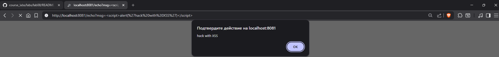
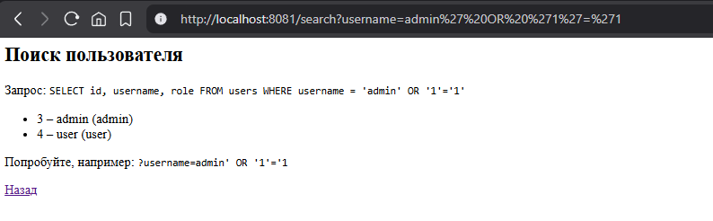
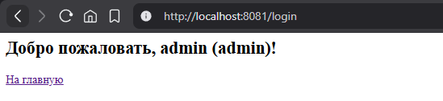
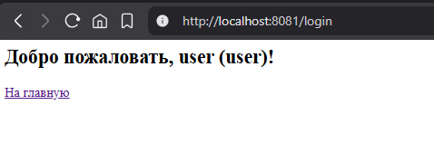
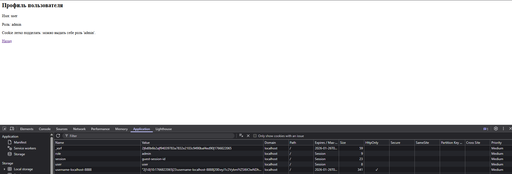
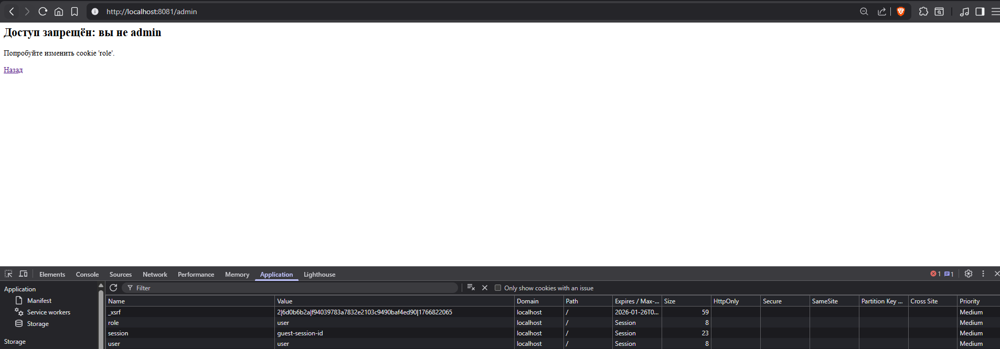
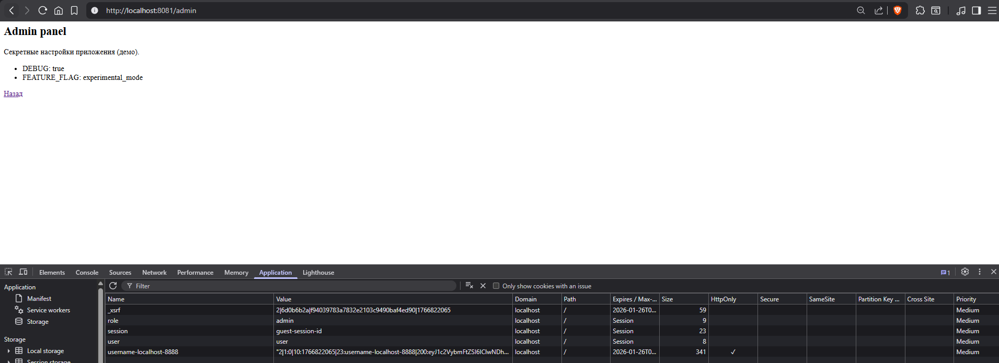

<div align="center">
<h1><a id="intro">Лабораторная работа №8</a><br></h1>
<a href="https://docs.github.com/en"></a>
<a href="https://daringfireball.net/projects/markdown"></a> 
<a href="https://symbl.cc/en/unicode-table"></a> 
<a href="https://shields.io"></a>
<a href="https://img.shields.io/badge/Risk_Analyze-2448a2"></a> </a> </a></div>

[x] 1. Разверните и подготовьте окружение для уязвимого приложения

```bash
bttrs@bttrs:~/Riski/course_labs/labs/lab08$ python3 -m venv venv
bttrs@bttrs:~/Riski/course_labs/labs/lab08$ source venv/bin/activate
(venv) bttrs@bttrs:~/Riski/course_labs/labs/lab08$ pip install -r requirements.txt && pip install -r vulnerable-app/requirements.txt
Requirement already satisfied: flask==2.2.5 in ./venv/lib/python3.10/site-packages (from -r requirements.txt (line 1)) (2.2.5)
Requirement already satisfied: werkzeug==2.2.3 in ./venv/lib/python3.10/site-packages (from -r requirements.txt (line 2)) (2.2.3)
Requirement already satisfied: itsdangerous==2.1.2 in ./venv/lib/python3.10/site-packages (from -r requirements.txt (line 3)) (2.1.2)
Requirement already satisfied: click==8.1.7 in ./venv/lib/python3.10/site-packages (from -r requirements.txt (line 4)) (8.1.7)
Requirement already satisfied: odfpy==1.4.1 in ./venv/lib/python3.10/site-packages (from -r requirements.txt (line 5)) (1.4.1)
Requirement already satisfied: openpyxl==3.1.2 in ./venv/lib/python3.10/site-packages (from -r requirements.txt (line 6)) (3.1.2)
Requirement already satisfied: Jinja2>=3.0 in ./venv/lib/python3.10/site-packages (from flask==2.2.5->-r requirements.txt (line 1)) (3.1.6)
Requirement already satisfied: MarkupSafe>=2.1.1 in ./venv/lib/python3.10/site-packages (from werkzeug==2.2.3->-r requirements.txt (line 2)) (3.0.3)
Requirement already satisfied: defusedxml in ./venv/lib/python3.10/site-packages (from odfpy==1.4.1->-r requirements.txt (line 5)) (0.7.1)
Requirement already satisfied: et-xmlfile in ./venv/lib/python3.10/site-packages (from openpyxl==3.1.2->-r requirements.txt (line 6)) (2.0.0)
Requirement already satisfied: flask==2.2.5 in ./venv/lib/python3.10/site-packages (from -r vulnerable-app/requirements.txt (line 1)) (2.2.5)
Requirement already satisfied: werkzeug==2.2.3 in ./venv/lib/python3.10/site-packages (from -r vulnerable-app/requirements.txt (line 2)) (2.2.3)
Requirement already satisfied: itsdangerous==2.1.2 in ./venv/lib/python3.10/site-packages (from -r vulnerable-app/requirements.txt (line 3)) (2.1.2)
Requirement already satisfied: click==8.1.7 in ./venv/lib/python3.10/site-packages (from -r vulnerable-app/requirements.txt (line 4)) (8.1.7)
Requirement already satisfied: odfpy==1.4.1 in ./venv/lib/python3.10/site-packages (from -r vulnerable-app/requirements.txt (line 5)) (1.4.1)
Requirement already satisfied: openpyxl==3.1.2 in ./venv/lib/python3.10/site-packages (from -r vulnerable-app/requirements.txt (line 6)) (3.1.2)
Requirement already satisfied: Jinja2>=3.0 in ./venv/lib/python3.10/site-packages (from flask==2.2.5->-r vulnerable-app/requirements.txt (line 1)) (3.1.6)
Requirement already satisfied: MarkupSafe>=2.1.1 in ./venv/lib/python3.10/site-packages (from werkzeug==2.2.3->-r vulnerable-app/requirements.txt (line 2)) (3.0.3)
Requirement already satisfied: defusedxml in ./venv/lib/python3.10/site-packages (from odfpy==1.4.1->-r vulnerable-app/requirements.txt (line 5)) (0.7.1)
Requirement already satisfied: et-xmlfile in ./venv/lib/python3.10/site-packages (from openpyxl==3.1.2->-r vulnerable-app/requirements.txt (line 6)) (2.0.0)
```

[x] 2. Запустите уязвимое приложение

```bash
(venv) bttrs@bttrs:~/Riski/course_labs/labs/lab08$ docker compose up -d --build
WARN[0000] /home/bttrs/Riski/course_labs/labs/lab08/docker-compose.yml: the attribute `version` is obsolete, it will be ignored, please remove it to avoid potential confusion 
[+] Building 6.6s (12/12) FINISHED                                                                                                                                                                           
 => [internal] load local bake definitions                                                                                                                                                              0.1s
 => => reading from stdin 590B                                                                                                                                                                          0.1s
 => [internal] load build definition from Dockerfile                                                                                                                                                    0.1s
 => => transferring dockerfile: 255B                                                                                                                                                                    0.0s
 => [internal] load metadata for docker.io/library/python:3.11-slim                                                                                                                                     1.8s
 => [internal] load .dockerignore                                                                                                                                                                       0.3s
 => => transferring context: 2B                                                                                                                                                                         0.0s
 => [1/5] FROM docker.io/library/python:3.11-slim@sha256:c24e9effa2821a6885165d930d939fec2af0dcf819276138f11dd45e200bd032                                                                               0.4s
 => => resolve docker.io/library/python:3.11-slim@sha256:c24e9effa2821a6885165d930d939fec2af0dcf819276138f11dd45e200bd032                                                                               0.3s
 => [internal] load build context                                                                                                                                                                       0.1s
 => => transferring context: 63B                                                                                                                                                                        0.0s
 => CACHED [2/5] WORKDIR /app                                                                                                                                                                           0.0s
 => CACHED [3/5] COPY requirements.txt .                                                                                                                                                                0.0s
 => CACHED [4/5] RUN pip install --no-cache-dir -r requirements.txt                                                                                                                                     0.0s
 => CACHED [5/5] COPY app.py .                                                                                                                                                                          0.0s
 => exporting to image                                                                                                                                                                                  1.7s
 => => exporting layers                                                                                                                                                                                 0.0s
 => => exporting manifest sha256:c702e130ef08681143858ec4b2a07937fbec495cd0625968a6795ef951e9d74d                                                                                                       0.0s
 => => exporting config sha256:dd14d488e12028e41f3aa78d5e70656a59a93f4fc5e63960f424a067778c0cc0                                                                                                         0.0s
 => => exporting attestation manifest sha256:22e9ba017fdfbd3882ddb3077d1d163a1ce80b75bb7f9412882e285bb643b5f4                                                                                           0.3s
 => => exporting manifest list sha256:13604b9429ed625f9210358d6c5e1e319c60bde68682e32725f444923f269990                                                                                                  0.1s
 => => naming to docker.io/library/lab08-vulnerable-app:latest                                                                                                                                          0.0s
 => => unpacking to docker.io/library/lab08-vulnerable-app:latest                                                                                                                                       0.8s
 => resolving provenance for metadata file                                                                                                                                                              0.1s
[+] up 2/2
 ✔ Image lab08-vulnerable-app     Built                                                                                                                                                                 8.3s 
 ✔ Container lab08-vulnerable-app Recreated
```

[x] 3. Проверьте доступность приложения

```bash
(venv) bttrs@bttrs:~/Riski/course_labs/labs/lab08$ curl -i http://localhost:8081
HTTP/1.1 200 OK
Server: Werkzeug/2.2.3 Python/3.11.14
Date: Wed, 14 Jan 2026 20:29:26 GMT
Content-Type: text/html; charset=utf-8
Content-Length: 625
Set-Cookie: session=guest-session-id; Path=/
Connection: close


<h1>Vulnerable DAST Demo App</h1>
<p>Пример уязвимого приложения для лабораторной по DAST.</p>
<ul>
    <li><a href="/echo?msg=Hello">Reflected XSS / echo</a></li>
    <li><a href="/search?username=admin">SQL Injection / search</a></li>
    <li><a href="/login">Небезопасный логин</a></li>
    <li><a href="/profile">Профиль (зависит от cookie)</a></li>
    <li><a href="/admin">«Админка» без нормальной авторизации</a></li>
    <li><a href="/files/">Directory listing</a></li>
</ul>
```

[x] 4. Проведите ручное исследование уязвимостей и опишите почему такое происходит, каким образом реализуются уязвимости и дайте им определение

[x] 4.1. `/echo` - проверить отражение параметра  `msg`  в `HTML` и использовать `payload` вида  `<script>alert('XSS')</script>` зафиксировав его поведение  

  

Получилось проэксплуатировать уязвимость XSS посредством передачи в URL js-скрипта

[x] 4.2. `/search` - проверить обычный запрос  `?username=admin` и использовать строку `?username=admin' OR '1'='1` зафиксировав его поведение описав признак SQLi  

  

Провели SQL-Injection и нашли 4 пользователя

[x] 4.3. `/login` - войти под  `admin`  и  `user` проверив логику на открытые пароли и простые SQL‑запросы  

  

  

Учетки содержат слабые пароли и получилось войти под ними

[x] 4.4. `/profile` - изменить `cookie`  `role`  на  `admin`  через `DevTools → Application → Cookies` и обновить  `/profile` (возможно создать `cookie`)  

  

Через DevTools изменил параметр `role` на `admin` и в веб отобразилась роль админа

[x] 4.5. `/admin` -  проверить, что доступ запрещён без `cookie  role=admin` и далее подделать `cookie`, что «админка» открывается путем изменения через `DevTools`. Подсказка: доступ завязан на значение cookie, без подписи/ токена/ серверной проверки.  

С `role` `user`  
  

С `role` `admin`  
 

[x] 4.6. `/files/` - просмотрите directory listing и откройте один из файлов убедившись, что оно выводится

```bash
(venv) bttrs@bttrs:~/Riski/course_labs/labs/lab08$ curl http://localhost:8081/files/secret.txt
<pre>SECRET_TOKEN=123456
```

[x] 5. Доработайте по пп 4 лабораторную работу развив их содержимое, которое может выводиться (мин 1 пример)

1. Вывод паролей пользователей
```bash
(venv) bttrs@bttrs:~/Riski/course_labs/labs/lab08$ curl -G "http://localhost:8081/search" --data-urlencode "username=' UNION SELECT 1,username,password FROM users--"

    <h2>Поиск пользователя</h2>
    <p>Запрос: <code>SELECT id, username, role FROM users WHERE username = &#39;&#39; UNION SELECT 1,username,password FROM users--&#39;</code></p>
    
    
      <ul>
      
        <li>1 – admin (admin123)</li>
      
        <li>1 – user (user123)</li>
      
      </ul>
    
    <p>Попробуйте, например: <code>?username=admin' OR '1'='1</code></p>
    <a href="/">Назад</a>
```

2. Кука админки на `/admin`
```bash
(venv) bttrs@bttrs:~/Riski/course_labs/labs/lab08$ curl -b "role=admin" "http://localhost:8081/admin"

    <h2>Admin panel</h2>
    <p>Секретные настройки приложения (демо).</p>
    <ul>
      <li>DEBUG: true</li>
      <li>FEATURE_FLAG: experimental_mode</li>
    </ul>
    <a href="/">Назад</a>
```

[x] 6. Поставьте `OWASP ZAP` и стяните образ конкртеной версии для него

```bash
(venv) bttrs@bttrs:~/Riski/course_labs/labs/lab08$ docker pull ghcr.io/zaproxy/zaproxy:stable
stable: Pulling from zaproxy/zaproxy
de833ed2578d: Pulling fs layer 
de833ed2578d: Pull complete 
9cc7b9ca7788: Pull complete 
f366d434b6fc: Pull complete 
bf2297e7cd8d: Pull complete 
87ba3504d442: Pull complete 
08eef0be2aa4: Pull complete 
4f4fb700ef54: Pull complete 
e0a7ecd670cf: Pull complete 
5d35d2f8c19f: Pull complete 
66e55ea493c9: Pull complete 
ff34a238b9c4: Pull complete 
a3ce4dd8a0be: Pull complete 
eab29e9c387d: Pull complete 
a1b9d5c7d548: Pull complete 
fb15404aa629: Pull complete 
e54ee67029ae: Pull complete 
dc5d46bcd90b: Pull complete 
9e9c2f9e1f29: Pull complete 
108c5836e3c7: Pull complete 
Digest: sha256:8e79e827afb9e8bdba390c829eb3062062cdb407570559e2ddebd49130c00a59
Status: Downloaded newer image for ghcr.io/zaproxy/zaproxy:stable
ghcr.io/zaproxy/zaproxy:stable
```

[x] 7. Задайте переменные окружения для работы скриптов

```bash
(venv) bttrs@bttrs:~/Riski/course_labs/labs/lab08$ export ZAP_IMAGE=ghcr.io/zaproxy/zaproxy:stable
(venv) bttrs@bttrs:~/Riski/course_labs/labs/lab08$ export TARGET_URL="http://host.docker.internal:8081"
```

[x] 8. Запустите скрипт автоматического сканирования DAST `OWASP ZAP`

```bash
(venv) bttrs@bttrs:~/Riski/course_labs/labs/lab08/dast$ ./zap_scan.sh 
[*] Running OWASP ZAP baseline scan against http://10.0.2.15:8081
[i] Using image: ghcr.io/zaproxy/zaproxy:stable
[i] Reports will be saved to /home/bttrs/Riski/course_labs/labs/lab08/dast/reports
Using the Automation Framework
Total of 13 URLs
PASS: Vulnerable JS Library (Powered by Retire.js) [10003]
PASS: In Page Banner Information Leak [10009]
PASS: Cookie Without Secure Flag [10011]
PASS: Re-examine Cache-control Directives [10015]
PASS: Cross-Domain JavaScript Source File Inclusion [10017]
PASS: Content-Type Header Missing [10019]
PASS: Information Disclosure - Debug Error Messages [10023]
PASS: Information Disclosure - Sensitive Information in HTTP Referrer Header [10025]
PASS: HTTP Parameter Override [10026]
PASS: Information Disclosure - Suspicious Comments [10027]
PASS: Off-site Redirect [10028]
PASS: Cookie Poisoning [10029]
PASS: User Controllable Charset [10030]
PASS: User Controllable HTML Element Attribute (Potential XSS) [10031]
PASS: Viewstate [10032]
PASS: Directory Browsing [10033]
PASS: Heartbleed OpenSSL Vulnerability (Indicative) [10034]
PASS: Strict-Transport-Security Header [10035]
PASS: Server Leaks Information via "X-Powered-By" HTTP Response Header Field(s) [10037]
PASS: X-Backend-Server Header Information Leak [10039]
PASS: Secure Pages Include Mixed Content [10040]
PASS: HTTP to HTTPS Insecure Transition in Form Post [10041]
PASS: HTTPS to HTTP Insecure Transition in Form Post [10042]
PASS: User Controllable JavaScript Event (XSS) [10043]
PASS: Big Redirect Detected (Potential Sensitive Information Leak) [10044]
PASS: Retrieved from Cache [10050]
PASS: X-ChromeLogger-Data (XCOLD) Header Information Leak [10052]
PASS: CSP [10055]
PASS: X-Debug-Token Information Leak [10056]
PASS: Username Hash Found [10057]
PASS: X-AspNet-Version Response Header [10061]
PASS: PII Disclosure [10062]
PASS: Timestamp Disclosure [10096]
PASS: Hash Disclosure [10097]
PASS: Cross-Domain Misconfiguration [10098]
PASS: Weak Authentication Method [10105]
PASS: Reverse Tabnabbing [10108]
PASS: Modern Web Application [10109]
PASS: Dangerous JS Functions [10110]
PASS: Verification Request Identified [10113]
PASS: Script Served From Malicious Domain (polyfill) [10115]
PASS: ZAP is Out of Date [10116]
PASS: Absence of Anti-CSRF Tokens [10202]
PASS: Private IP Disclosure [2]
PASS: Session ID in URL Rewrite [3]
PASS: Script Passive Scan Rules [50001]
PASS: Stats Passive Scan Rule [50003]
PASS: Insecure JSF ViewState [90001]
PASS: Java Serialization Object [90002]
PASS: Sub Resource Integrity Attribute Missing [90003]
PASS: Charset Mismatch [90011]
PASS: Application Error Disclosure [90022]
PASS: WSDL File Detection [90030]
PASS: Loosely Scoped Cookie [90033]
WARN-NEW: Cookie No HttpOnly Flag [10010] x 2 
        http://10.0.2.15:8081 (200 OK)
        http://10.0.2.15:8081/ (200 OK)
WARN-NEW: Missing Anti-clickjacking Header [10020] x 5 
        http://10.0.2.15:8081 (200 OK)
        http://10.0.2.15:8081/echo?msg=Hello (200 OK)
        http://10.0.2.15:8081/login (200 OK)
        http://10.0.2.15:8081/profile (200 OK)
        http://10.0.2.15:8081/search?username=admin (200 OK)
WARN-NEW: X-Content-Type-Options Header Missing [10021] x 5 
        http://10.0.2.15:8081 (200 OK)
        http://10.0.2.15:8081/echo?msg=Hello (200 OK)
        http://10.0.2.15:8081/login (200 OK)
        http://10.0.2.15:8081/profile (200 OK)
        http://10.0.2.15:8081/search?username=admin (200 OK)
WARN-NEW: Information Disclosure - Sensitive Information in URL [10024] x 1 
        http://10.0.2.15:8081/search?username=admin (200 OK)
WARN-NEW: Server Leaks Version Information via "Server" HTTP Response Header Field [10036] x 5 
        http://10.0.2.15:8081 (200 OK)
        http://10.0.2.15:8081/echo?msg=Hello (200 OK)
        http://10.0.2.15:8081/robots.txt (404 Not Found)
        http://10.0.2.15:8081/search?username=admin (200 OK)
        http://10.0.2.15:8081/sitemap.xml (404 Not Found)
WARN-NEW: Content Security Policy (CSP) Header Not Set [10038] x 5 
        http://10.0.2.15:8081 (200 OK)
        http://10.0.2.15:8081/echo?msg=Hello (200 OK)
        http://10.0.2.15:8081/robots.txt (404 Not Found)
        http://10.0.2.15:8081/search?username=admin (200 OK)
        http://10.0.2.15:8081/sitemap.xml (404 Not Found)
WARN-NEW: Non-Storable Content [10049] x 6 
        http://10.0.2.15:8081/admin (403 Forbidden)
        http://10.0.2.15:8081 (200 OK)
        http://10.0.2.15:8081/echo?msg=Hello (200 OK)
        http://10.0.2.15:8081/robots.txt (404 Not Found)
        http://10.0.2.15:8081/search?username=admin (200 OK)
WARN-NEW: Cookie without SameSite Attribute [10054] x 2 
        http://10.0.2.15:8081 (200 OK)
        http://10.0.2.15:8081/ (200 OK)
WARN-NEW: Permissions Policy Header Not Set [10063] x 5 
        http://10.0.2.15:8081 (200 OK)
        http://10.0.2.15:8081/echo?msg=Hello (200 OK)
        http://10.0.2.15:8081/robots.txt (404 Not Found)
        http://10.0.2.15:8081/search?username=admin (200 OK)
        http://10.0.2.15:8081/sitemap.xml (404 Not Found)
WARN-NEW: Source Code Disclosure - SQL [10099] x 1 
        http://10.0.2.15:8081/search?username=admin (200 OK)
WARN-NEW: Authentication Request Identified [10111] x 1 
        http://10.0.2.15:8081/login (200 OK)
WARN-NEW: Session Management Response Identified [10112] x 2 
        http://10.0.2.15:8081 (200 OK)
        http://10.0.2.15:8081/ (200 OK)
WARN-NEW: Insufficient Site Isolation Against Spectre Vulnerability [90004] x 9 
        http://10.0.2.15:8081 (200 OK)
        http://10.0.2.15:8081/echo?msg=Hello (200 OK)
        http://10.0.2.15:8081/search?username=admin (200 OK)
        http://10.0.2.15:8081 (200 OK)
        http://10.0.2.15:8081/echo?msg=Hello (200 OK)
FAIL-NEW: 0     FAIL-INPROG: 0  WARN-NEW: 13    WARN-INPROG: 0  INFO: 0 IGNORE: 0       PASS: 54
[+] ZAP scan completed. Reports (if any) in /home/bttrs/Riski/course_labs/labs/lab08/dast/reports
-rw-r--r-- 1 bttrs bttrs 97K янв 15 00:29 /home/bttrs/Riski/course_labs/labs/lab08/dast/reports/zap-report-20260115_002829.html
-rw-r--r-- 1 bttrs bttrs 36K янв 15 00:29 /home/bttrs/Riski/course_labs/labs/lab08/dast/reports/zap-report-20260115_002829.json
-rw-r--r-- 1 bttrs bttrs 43K янв 15 00:29 /home/bttrs/Riski/course_labs/labs/lab08/dast/reports/zap-report-20260115_002829.xml
[*] Converting JSON report to ODT/XLSX using /home/bttrs/Riski/course_labs/labs/lab08/dast/../venv/bin/python ...
[debug] python: /home/bttrs/Riski/course_labs/labs/lab08/dast/../venv/bin/python
[debug] odf imported OK
[*] Parsing ZAP JSON report: zap-report-20260115_002829.json
[i] Found 14 alerts
[+] ODT report saved: odt/zap-report-20260115_002829.odt
[+] XLSX report saved: xlsx/zap-report-20260115_002829.xlsx
[+] Report conversion completed!
```

[x] 9. Изучите сгенерированные отчеты в `dast/reports` и опишите риски ИБ для них, без сценариев, так как ранее вы видели часть из их реализации

| № | Alert ID | Уязвимость | Риск ИБ | Категория |
|---|----------|------------|---------|-----------|
| 1 | 10010 | **Cookie No HttpOnly Flag** | Cookie может быть украдена через XSS-атаку с помощью `document.cookie` | Session Hijacking |
| 2 | 10020 | **Missing Anti-clickjacking Header** | Страница может быть встроена в iframe на вредоносном сайте для Clickjacking-атаки | UI Redress Attack |
| 3 | 10021 | **X-Content-Type-Options Header Missing** | Браузер может неверно интерпретировать MIME-тип, что ведёт к XSS через MIME-sniffing | XSS |
| 4 | 10024 | **Sensitive Information in URL** | Параметр `username` в URL может утечь через Referer, историю браузера, логи | Information Disclosure |
| 5 | 10036 | **Server Leaks Version Information** | Заголовок `Server: Werkzeug/2.2.3 Python/3.11.14` раскрывает версии — помогает атакующему подобрать эксплойты | Reconnaissance |
| 6 | 10038 | **CSP Header Not Set** | Отсутствие Content-Security-Policy позволяет выполнять inline-скрипты и загружать ресурсы с любых доменов | XSS, Data Injection |
| 7 | 10049 | **Non-Storable Content** | Контент не кэшируется — информационное предупреждение, низкий риск | Performance |
| 8 | 10054 | **Cookie without SameSite Attribute** | Cookie отправляется при cross-site запросах — риск CSRF-атаки | CSRF |
| 9 | 10063 | **Permissions Policy Header Not Set** | Не ограничены возможности браузера (камера, геолокация и т.д.) | Privacy Leak |
| 10 | 10099 | **Source Code Disclosure - SQL** | В ответе виден SQL-запрос — раскрывает структуру БД атакующему | Information Disclosure |
| 11 | 10111 | **Authentication Request Identified** | ZAP нашёл форму логина — информационное | Info |
| 12 | 10112 | **Session Management Response Identified** | ZAP обнаружил управление сессией через cookie | Info |
| 13 | 90004 | **Insufficient Site Isolation Against Spectre** | Отсутствуют заголовки `Cross-Origin-Opener-Policy` и `Cross-Origin-Embedder-Policy` — теоретический риск Spectre-атак | Side-Channel Attack |

### Критичность по уровням

| Уровень | Количество | Уязвимости |
|---------|------------|------------|
| **High** | 3 | Cookie без HttpOnly/SameSite, отсутствие CSP |
| **Medium** | 5 | Clickjacking, X-Content-Type-Options, Server version leak, SQL disclosure |
| **Low** | 3 | Permissions Policy, Spectre isolation |
| **Info** | 2 | Authentication/Session identified |

[x] 10. Внесите исправления по данному отчету DAST для `vulnerable-app/app.py`

### Внесённые исправления

| Уязвимость | Исправление | Код |
|------------|-------------|-----|
| **Cookie No HttpOnly** | Добавлен флаг `httponly=True` | `set_cookie(..., httponly=True)` |
| **Cookie No SameSite** | Добавлен флаг `samesite='Lax'` | `set_cookie(..., samesite='Lax')` |
| **Missing X-Frame-Options** | Добавлен middleware с заголовком | `response.headers['X-Frame-Options'] = 'DENY'` |
| **Missing X-Content-Type-Options** | Добавлен заголовок | `response.headers['X-Content-Type-Options'] = 'nosniff'` |
| **Missing CSP** | Добавлен Content-Security-Policy | `response.headers['Content-Security-Policy'] = "default-src 'self'"` |
| **Missing Permissions-Policy** | Добавлен заголовок | `response.headers['Permissions-Policy'] = 'geolocation=()...'` |
| **Spectre Isolation** | Добавлены COOP/COEP заголовки | `Cross-Origin-Opener-Policy: same-origin` |
| **SQL Injection** | Параметризованные запросы | `cur.execute("SELECT ... WHERE username = ?", (username,))` |
| **XSS** | Экранирование пользовательского ввода | `from html import escape; escape(msg)` |
| **SQL Disclosure** | Убран вывод SQL-запроса в ответе | Показывается только параметр поиска |
| **Path Traversal** | Проверка `realpath` и `startswith` | `if not full_path.startswith(target_dir): return 403` |
| **Debug Mode** | Отключён debug | `app.run(debug=False)` |

[x] 11. Делайте все необходимые коммиты по шагам и отправляйте изменения в удалённый репозиторий

[x] 12. Подготовьте отчет `gist`.

[x] 13. Почистите кеш от `venv` и остановите уязвимое приложение
```bash
bttrs@bttrs:~/Riski/course_labs/labs/lab08$ rm -rf venv
bttrs@bttrs:~/Riski/course_labs/labs/lab08$ docker compose -f docker-compose.yml down
WARN[0000] /home/bttrs/Riski/course_labs/labs/lab08/docker-compose.yml: the attribute `version` is obsolete, it will be ignored, please remove it to avoid potential confusion 
[+] down 1/2
 ✔ Container lab08-vulnerable-app Removed                                                                                                                                                             5.1s 
 ⠦ Network lab08-net              Removing     
```

---

Copyright (c) 2025 Egor Davydov
